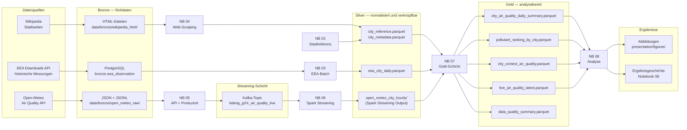
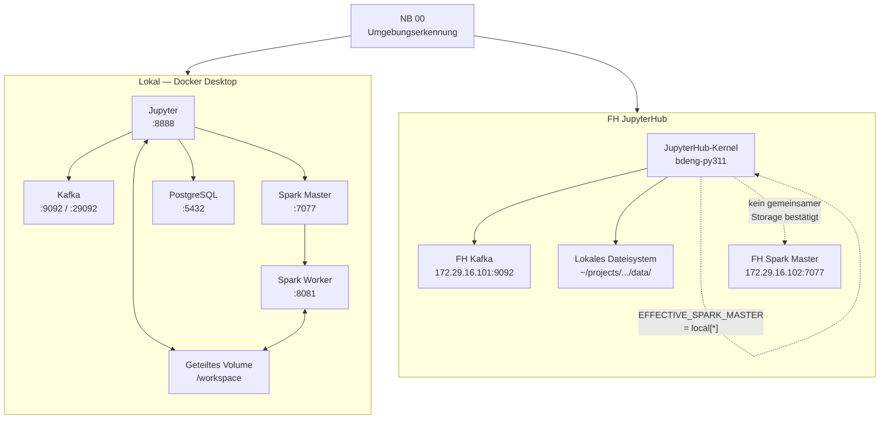
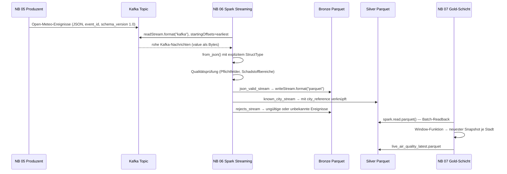
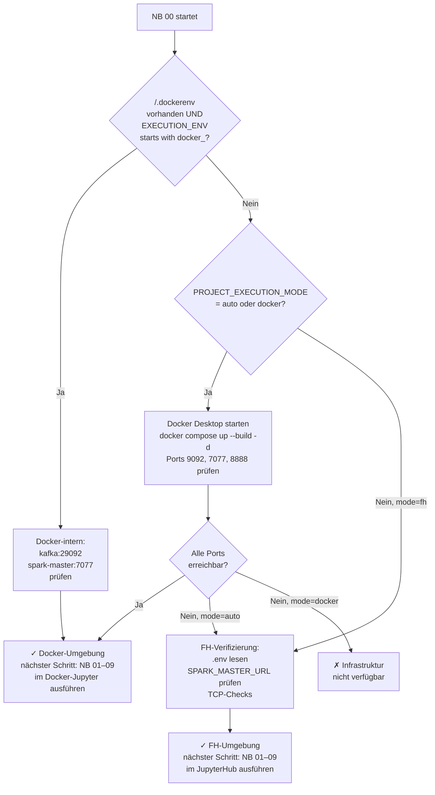

# Euro Air Quality Pipeline

> Ein Notebook-basiertes Data-Engineering-Projekt zur Luftqualität in ausgewählten europäischen Großstädten — von der Rohdatenquelle bis zur nachvollziehbaren Ergebnisgeschichte.

---

## Die Geschichte: Was zeigt dieses Projekt?

Europäische Großstädte weisen messbar unterschiedliche Luftqualitätsmuster auf. Dieses Projekt beantwortet die Frage, wie sich **PM2.5, PM10 und NO2** zwischen acht ausgewählten Städten unterscheiden — und welchen vorsichtig interpretierbaren Kontext städtische Metadaten wie Bevölkerungsdichte liefern.

Die Analyse basiert auf drei methodisch klar getrennten Quellen:

| Quelle | Zeitraum | Aussage |
| --- | --- | --- |
| **EEA Downloads API** | historisch (Anfang 2025) | Gemessene Schadstoffwerte je Stadt und Tag |
| **Wikipedia-Stadtseiten** | aktuell | Bevölkerung, Fläche, Bevölkerungsdichte als Kontext |
| **Open-Meteo Air Quality API** | Live-Snapshot | Aktueller Stand als Kafka-und-Spark-Nachweis |

**Was die Daten zeigen (Stand: 2-Tage-EEA-Stichprobe 1.–2. Januar 2025):**

| Schadstoff | Höchster Wert | Niedrigster Wert | Besonderheit |
| --- | --- | --- | --- |
| **PM2.5** | Wien 29,0 µg/m³ | Paris 8,3 µg/m³ | Winterheizung in AT erklärt erhöhte Werte |
| **PM10** | Wien 30,8 µg/m³ | Paris 10,8 µg/m³ | Wien und Prag deutlich über Westeuropa |
| **NO2** | Madrid 42,7 µg/m³ | Berlin 9,9 µg/m³ | Madrid Verkehr, Rom Platz 2 mit 33,0 µg/m³ |

Rom fehlt bei PM10 und PM2.5 in der EEA-Stichprobe — die EEA-Stationsabdeckung für diesen Zeitraum ist unvollständig.

**Wichtige Einschränkung:** Die bisherigen QA-Smoke-Tests verwendeten kurze Zeiträume. Notebook `03` ist jetzt standardmäßig auf `[2025-01-01, 2026-01-01)` und damit exakt `365` Tage eingestellt. Die Qualitätssicherung in Notebook `07` sperrt finale Aussagen automatisch, falls die tatsächlich geladenen Daten weniger als `365` Tage abdecken.

Die Bevölkerungsdichte erklärt Unterschiede nur teilweise; Heizungsverhalten, Geografie und Verkehr spielen eine mindestens ebenso große Rolle.

**Was die Daten nicht zeigen:** Kausalitäten, universelle Stadtranglisten oder Langzeittrends. Der EEA-Datenzeitraum ist kurz, der Open-Meteo-Snapshot ist zeitpunktuell. Alle Aussagen sind deskriptiv und explorativ.

---

## Die Medallion-Architektur: Bronze, Silver und Gold

Dieses Projekt verwendet das **Medallion-Muster** — eine bewährte Strategie aus dem Data Engineering, die Rohdaten schrittweise in analysebereite Informationen verwandelt. Jede Schicht hat eine klar definierte Aufgabe und einen eigenen Qualitätsanspruch.

```mermaid
flowchart LR
    subgraph B["🥉 Bronze — Rohdaten"]
        direction TB
        B1["Quelltreu gespeichert\nnichts wird gelöscht"]
        B2["PostgreSQL: EEA-Messwerte\nHTML: Wikipedia-Seiten\nJSON: Open-Meteo-Antworten\nJSONL: Kafka-Ereignisse"]
        B3["Wann: sofort nach dem Abruf\nNulls: erlaubt\nTransformation: keine"]
    end

    subgraph S["🥈 Silver — normalisiert"]
        direction TB
        S1["Bereinigt und validiert\nkonsistentes Schema"]
        S2["city_reference.parquet\ncity_metadata.parquet\neea_city_daily.parquet\nopen_meteo_city_hourly/"]
        S3["Wann: nach Validierung\nNulls: dokumentiert\nTransformation: Aggregation, Join-fähig"]
    end

    subgraph G["🥇 Gold — analysebereit"]
        direction TB
        G1["Aggregiert und angereichert\nbusiness-ready"]
        G2["city_air_quality_daily_summary\npollutant_ranking_by_city\ncity_context_air_quality\nlive_air_quality_latest"]
        G3["Wann: nach Qualitätsprüfung\nNulls: erklärt\nTransformation: Kennzahlen, Rangfolgen"]
    end

    B -->|"Cleaning + Aggregation"| S
    S -->|"Anreicherung + Qualitätsbericht"| G
```



### Was bedeuten die drei Schichten konkret?

**Bronze — Die Wahrheit der Quelle**

Bronze-Daten sind eine exakte, unveränderliche Kopie der Quelldaten. In diesem Projekt:
- PostgreSQL-Tabelle `bronze.eea_observation`: stündliche EEA-Messwerte mit allen Originalfeldern (`Samplingpoint`, `Pollutant`, `Validity`, `Verification`)
- HTML-Dateien unter `data/bronze/wikipedia_html/`: rohe Wikipedia-Seiten zum Zeitpunkt des Abrufs
- JSON-Dateien unter `data/bronze/open_meteo_raw/`: vollständige API-Antworten der Open-Meteo-API
- Parquet-Streaming-Dateien unter `data/bronze/open_meteo_stream/`: jedes empfangene Kafka-Ereignis, einschließlich Rejects

**Warum Bronze?** Wenn eine Transformation später als falsch erkannt wird, können die Originaldaten neu verarbeitet werden, ohne die Quelle erneut abzufragen.

**Silver — Die aufbereitete Wahrheit**

Silver-Daten sind bereinigt, validiert und mit gemeinsamen Schlüsseln (`city_id`) join-fähig. In diesem Projekt:
- EEA-Messungen auf Tagesmittelwerte aggregiert (`mean_value`, `min_value`, `max_value`)
- Wikipedia-Metadaten mit `parse_status` dokumentiert — fehlende Werte bleiben `NaN`, werden nicht geschätzt
- Spark-Streaming-Output mit Stadtdaten angereichert, ungültige Ereignisse in Rejects-Stream ausgelagert
- `city_reference.parquet` dient als gemeinsames Lookup aller anderen Tabellen

**Warum Silver?** Die Analyseschicht arbeitet immer mit sauberen, konsistenten Daten — unabhängig davon, wie unordentlich die Quelle war.

**Gold — Die Antwort auf die Leitfrage**

Gold-Daten sind aggregierte, angereicherte Tabellen, die direkt für Analysen und Visualisierungen verwendet werden. In diesem Projekt:
- Schadstoffrangfolgen je Stadt (`pollutant_ranking_by_city`)
- Tageswerte mit Stadtkontext verknüpft (`city_context_air_quality`)
- Qualitätsbericht mit `final_analytical_claims_allowed`-Flag

**Warum Gold?** Notebook 08 liest ausschließlich Gold — keine Transformationslogik, nur Interpretation und Visualisierung.

---

## Leitfrage

> *Wie unterscheiden sich PM2.5-, PM10- und NO2-Muster zwischen ausgewählten europäischen Städten, und welchen vorsichtig interpretierbaren Kontext liefern städtische Metadaten?*

---

## Abdeckung der Projektanforderungen

| Anforderung | Notebook | Umsetzung |
| --- | :---: | --- |
| Datei- oder Datenbankquelle | 03 | EEA-Messungen über PostgreSQL-Bronze-Tabelle |
| Web-Scraping | 04 | Wikipedia-HTML-Abruf und Parsing |
| REST-API | 05 | Open-Meteo Air Quality API |
| Kafka-Produzent und Topic | 05 | Open-Meteo-Ereignisse → gruppenspezifisches Kafka-Topic |
| Spark liest aus Kafka | 06 | Spark Structured Streaming → Parquet |
| Persistenz transformierter Daten | 02–07 | Silver- und Gold-Parquet unter `data/` |
| Visualisierung des Datenflusses | — | Mermaid-Diagramme in `docs/diagrams/` und dieser README |
| Nachvollziehbare Ergebnisgeschichte | 08 | Deutschsprachige Analyse, Diagramme, Präsentation |
| Dokumentation der Arbeitsschritte | 00–09 | Jedes Notebook enthält Zweck, Eingaben, Ausgaben, Validierung |
| Öffentliches GitHub-Repository | — | [github.com/OnlyMajorG/euro-air-quality-pipeline](https://github.com/OnlyMajorG/euro-air-quality-pipeline) |

---

## Architektur

### Medallion-Architektur: Bronze → Silver → Gold



### Systemarchitektur: Zwei Betriebsumgebungen



### Datenfluss und Kafka-Spark-Pfad



---

## Umgebungserkennung: Docker vs. FH

Notebook 00 erkennt die Ausführungsumgebung automatisch und startet oder prüft die Infrastruktur ohne manuelle Eingriffe. Die Erkennungslogik:



**Entscheidende Unterschiede zwischen den Umgebungen:**

| Merkmal | Docker lokal | FH JupyterHub |
| --- | --- | --- |
| `SPARK_MASTER_URL` | `spark://spark-master:7077` | `spark://172.29.16.102:7077` |
| Effektiver Spark-Master (NB 06) | `spark://spark-master:7077` | `local[*]` (automatisch) |
| Geteilter Storage Spark ↔ Jupyter | ✅ `/workspace`-Volume | ❌ kein bestätigter gemeinsamer Pfad |
| `ALLOW_SHARED_SPARK_STORAGE` | `true` | `false` |
| Kafka-Bootstrap | `kafka:29092` (intern) | `172.29.16.101:9092` (FH) |
| PostgreSQL | `postgres:5432` (Docker) | nicht verfügbar |
| EEA-Batch-Notebook (NB 03) | vollständig lauffähig | ohne PostgreSQL eingeschränkt |

**Warum NB 06 in der FH-Umgebung `local[*]` verwendet:** Der FH Spark-Master verteilt Tasks auf Worker-Knoten, die keinen Zugriff auf den JupyterHub-lokalen Dateipfad `~/projects/.../data/` haben. Parquet-Ausgaben würden auf den Worker-Knoten landen, nicht auf dem JupyterHub-Dateisystem. Notebook 06 erkennt `SPARK_MASTER_URL.startswith("spark://")` und setzt `EFFECTIVE_SPARK_MASTER_URL = "local[*]"` automatisch — Kafka bleibt dabei echter FH-Broker, Spark läuft lokal im JupyterHub-Prozess.

---

## Inbetriebnahme

### Variante A: Lokal mit Docker Desktop (empfohlen für vollständigen Nachweis)

**Voraussetzungen:**
- Docker Desktop ≥ 4.x installiert und gestartet
- Python 3.10+ für den Bootstrap-Schritt
- Mindestens 8 GB RAM für Docker (Kafka + Spark + PostgreSQL + Jupyter)

**Schritt 1 — Repository klonen:**

```bash
git clone https://github.com/OnlyMajorG/euro-air-quality-pipeline.git
cd euro-air-quality-pipeline
```

**Schritt 2 — Lokale Python-Umgebung für den Bootstrap:**

```bash
python -m venv .venv
# Windows:
.venv\Scripts\activate
# Linux/macOS:
source .venv/bin/activate

pip install --upgrade pip
pip install jupyter python-dotenv
```

**Schritt 3 — Notebook 00 lokal öffnen und ausführen:**

```bash
jupyter notebook notebooks/00_project_scope_and_requirements.ipynb
```

Notebook 00 erkennt automatisch, dass Docker Desktop verfügbar ist, baut den Compose-Stack und startet alle Dienste. Dieser Schritt dauert beim ersten Mal 3–5 Minuten (Image-Download).

**Schritt 4 — In den Docker-Jupyter wechseln:**

```
http://localhost:8888 öffnen
```

Notebook 00 dort erneut ausführen. Die Ausgabe zeigt `selected_environment: docker`. Danach Notebooks 01 bis 09 der Reihe nach ausführen.

**Wichtig:** Für den vollständigen lokalen Kafka-zu-Spark-Nachweis Notebook `06` im Docker-Jupyter unter `http://localhost:8888` ausführen. Ein direkt auf dem Host gestarteter Bootstrap-Kernel besitzt den Spark-Kafka-Connector nicht zwingend und verwendet deshalb nur den transparent gekennzeichneten lokalen Dateistream-Fallback.

**Dienste und Ports:**

| Dienst | Port | Zweck |
| --- | --- | --- |
| Jupyter | 8888 | Notebook-Ausführung |
| Kafka | 9092 | Externer Broker-Zugang |
| Spark Master | 7077 | Spark-Cluster-Steuerung |
| Spark Master UI | 8080 | Monitoring |
| Spark Worker UI | 8081 | Worker-Status |
| PostgreSQL | 5432 | Bronze-Datenbank (EEA) |

**Stack herunterfahren:**

```bash
docker compose down
# Mit Daten-Reset:
docker compose down -v
```

---

### Variante B: FH JupyterHub

**Voraussetzungen:**
- Zugang zum FH JupyterHub mit Kernel `bdeng-py311`
- FH-Kafka-Broker erreichbar unter `172.29.16.101:9092`
- Gruppenspezifisches Topic angelegt (z.B. `bdeng_g1_air_quality_live`)

**Schritt 1 — Repository im JupyterHub-Terminal klonen:**

```bash
cd ~/projects
git clone https://github.com/OnlyMajorG/euro-air-quality-pipeline.git
cd euro-air-quality-pipeline
```

**Schritt 2 — `.env` für FH konfigurieren:**

```bash
# Fehlende Variablen ergänzen (im Terminal oder nano):
python3 - <<'PY'
from pathlib import Path

env_path = Path(".env")
# Ausgangswerte aus .env.cluster.example übernehmen falls noch keine .env vorhanden:
if not env_path.exists():
    import shutil
    shutil.copy(".env.cluster.example", ".env")
    print("Vorlage .env.cluster.example kopiert.")
else:
    print(".env bereits vorhanden.")
PY
```

Danach die `.env` öffnen und die FH-spezifischen Werte eintragen:

```bash
nano .env
```

Mindest-Konfiguration für die FH-Umgebung:

```env
EXECUTION_ENV=fh_kafka_local_spark
SPARK_MASTER_URL=spark://172.29.16.102:7077
KAFKA_BOOTSTRAP_SERVERS=172.29.16.101:9092
KAFKA_TOPIC_AIR_QUALITY_LIVE=bdeng_g1_air_quality_live
SPARK_KAFKA_MODE=kafka
ALLOW_SPARK_KAFKA_MOCK_FALLBACK=false
RUN_OPEN_METEO_KAFKA_PRODUCER=false
RESET_PHASE6_CHECKPOINTS=false
EEA_BRONZE_STORAGE_MODE=parquet
EEA_RUN_API_FETCH=true
EEA_DATE_START=2025-01-01T00:00:00Z
EEA_DATE_END=2026-01-01T00:00:00Z
EEA_ALLOW_SHORT_SMOKE_TEST=false
DATA_DIR=data
CHECKPOINT_DIR=data/checkpoints
```

**Schritt 3 — Notebooks der Reihe nach ausführen:**

Im JupyterHub-Interface Notebook `00` öffnen und ausführen. Danach `01` bis `09` in der angegebenen Reihenfolge.

**Hinweise für die FH-Umgebung:**
- Notebook 03 verwendet in der FH `EEA_BRONZE_STORAGE_MODE=parquet` und benötigt dort kein PostgreSQL. Mit `EEA_RUN_API_FETCH=false` liest es ein mitgebrachtes `data/bronze/eea/eea_observation.parquet`. Mit `EEA_RUN_API_FETCH=true` erzeugt es diese Datei direkt aus der EEA API.
- Notebook 05 mit `RUN_OPEN_METEO_KAFKA_PRODUCER=true` nur kurz ausführen, danach wieder auf `false` setzen.
- Wenn Notebook 06 bei leerem Checkpoint neu gestartet werden soll: `RESET_PHASE6_CHECKPOINTS=true` setzen, einmal ausführen, dann wieder auf `false`.

---

## Konfiguration

Alle Konfigurationswerte werden über eine nicht versionierte `.env` gesetzt. Drei Vorlagendateien stehen bereit:

| Vorlage | Verwendung |
| --- | --- |
| `.env.example` | Lokal ohne Docker, eigene Kafka- und Spark-Installation |
| `.env.docker.example` | Automatisch durch Docker Compose verwendet |
| `.env.cluster.example` | FH-JupyterHub mit geteiltem Cluster-Storage |

### Wichtige Umgebungsvariablen

| Variable | Beispielwert | Bedeutung |
| --- | --- | --- |
| `EXECUTION_ENV` | `docker_compose_shared_storage` | Laufzeitprofil; steuert Verhalten in mehreren Notebooks |
| `SPARK_MASTER_URL` | `spark://spark-master:7077` | Spark-Einstiegspunkt; wird in NB 06 ggf. auf `local[*]` überschrieben |
| `KAFKA_BOOTSTRAP_SERVERS` | `kafka:29092` | Kafka-Broker-Adresse |
| `KAFKA_TOPIC_AIR_QUALITY_LIVE` | `bdeng_g1_air_quality_live` | Gruppenspezifisches Topic für Live-Ereignisse |
| `SPARK_KAFKA_MODE` | `kafka` | `kafka` = strikt, `auto` = bevorzugt Kafka mit Fallback, `mock` = lokal |
| `ALLOW_SPARK_KAFKA_MOCK_FALLBACK` | `false` | Fallback auf lokalen Dateistream erlauben |
| `RUN_OPEN_METEO_KAFKA_PRODUCER` | `false` | Kafka-Produzent aktivieren (nur für Nachweislauf) |
| `KAFKA_CONNECTION_TIMEOUT_SECONDS` | `5` | Kurzer TCP-Preflight für FH-Kafka |
| `KAFKA_OPERATION_TIMEOUT_MS` | `15000` | Grenze für Kafka-Metadaten, Zustellung und Client-Anfragen |
| `RESET_PHASE6_CHECKPOINTS` | `false` | Spark-Streaming-Checkpoints vor NB 06 löschen |
| `ALLOW_SHARED_SPARK_STORAGE` | `true` | Gemeinsamen Storage für Driver und Worker bestätigt |
| `DATA_DIR` | `data` | Relativer oder absoluter Pfad zum Dateiverzeichnis |
| `CHECKPOINT_DIR` | `data/checkpoints` | Spark-Streaming-Checkpoint-Pfad |
| `EEA_BRONZE_STORAGE_MODE` | `postgres` oder `parquet` | Bronze-Backend für Notebook 03; Docker verwendet PostgreSQL, die FH ein portables Parquet |
| `EEA_RUN_API_FETCH` | `true` | EEA API erneut abrufen; mit `false` vorhandenen Bronze-Speicher lesen |
| `EEA_DATE_START` | `2025-01-01T00:00:00Z` | Startzeitpunkt für EEA-API-Abruf |
| `EEA_DATE_END` | `2026-01-01T00:00:00Z` | Exklusiver Endzeitpunkt; Default ergibt exakt `365` historische Tage |
| `EEA_ALLOW_SHORT_SMOKE_TEST` | `false` | Nur bewusst für kurze technische Läufe auf `true` setzen |
| `MIN_FINAL_HISTORY_DAYS` | `365` | Mindestanzahl Tage für finale empirische Aussagen |

---

## Notebook-Übersicht

Die Notebooks werden in numerischer Reihenfolge ausgeführt. Jedes Notebook ist eigenständig dokumentiert und enthält Eingaben, Ausgaben, Implementierung und Validierungsassertionen.

### 00 — Projektumfang und Infrastrukturstart

**Zweck:** Leitfrage, Anforderungen und Projektziele definieren. Ausführungsumgebung automatisch erkennen (Docker oder FH) und Infrastruktur starten oder prüfen.

**Besonderheit:** Einziges Notebook, das Docker Compose startet (`docker compose up --build -d`). Erkennt automatisch, ob es innerhalb des Docker-Jupyter-Containers oder extern läuft.

**Ausgaben:** Geprüfte Infrastruktur, `infrastructure_status`-Zusammenfassung, vollständige Anforderungs-zu-Notebook-Karte.

---

### 01 — Source-Spike und Cluster-Check

**Zweck:** Machbarkeit aller drei Datenquellen und der Cluster-Infrastruktur vor der Implementierung nachweisen. Dies ist ein Spike-Notebook — keine Produktionsdaten werden verarbeitet.

**Prüfungen:** TCP-Erreichbarkeit von Kafka und Spark, EEA-API-Endpunkt, Open-Meteo-API, Wikipedia-Seite; Platzhalter in der `.env` werden abgelehnt.

**Ausgaben:** `connectivity_report` mit Status je Endpunkt; dient als Grundlage für Architekturentscheidungen.

---

### 02 — Stadtrereferenzmodell

**Zweck:** Den stabilen Stadtkatalog erstellen, der als gemeinsame `city_id`-Grundlage für EEA, Wikipedia, Open-Meteo, Kafka, Spark und alle Gold-Tabellen dient.

**Städte:** Wien, Berlin, Paris, Madrid, Rom, Amsterdam, Warschau, Prag.

**Ausgaben:**
- `data/silver/city_reference.parquet` — `city_id`, Name, Land, Koordinaten, EEA-Stationscodes, Open-Meteo-Koordinaten
- `data/silver/city_reference.csv` — Lesbare Kopie

---

### 03 — EEA-Batch-Ingestion

**Zweck:** Historische PM2.5-, PM10- und NO2-Messungen über die EEA Downloads API abrufen, quelltreu in PostgreSQL oder einem portablen Bronze-Parquet speichern und auf tägliche Silver-Parquet-Dateien aggregieren.

**Ablauf:**
1. EEA-API liefert Parquet-URLs je Stadt und Schadstoff.
2. Docker speichert Rohdaten in PostgreSQL-Bronze und exportiert zusätzlich ein portables Parquet.
3. Die FH liest oder erzeugt `data/bronze/eea/eea_observation.parquet` ohne PostgreSQL.
4. Silver-Aggregation: Tagesmittelwert, Minimum, Maximum je Stadt/Tag/Schadstoff.

**Ausgaben:**
- PostgreSQL: `bronze.eea_observation`
- Portables Bronze-Artefakt: `data/bronze/eea/eea_observation.parquet`
- `data/silver/eea_city_daily.parquet`

**Hinweis:** Der Default `[2025-01-01, 2026-01-01)` umfasst exakt ein Jahr. Kürzere technische Läufe benötigen ausdrücklich `EEA_ALLOW_SHORT_SMOKE_TEST=true`.

---

### 04 — Wikipedia-Web-Scraping

**Zweck:** Wikipedia-Stadtseiten als Pflicht-Web-Scraping-Quelle verwenden. Rohe HTML-Dateien in Bronze speichern, Stadtmetadaten parsen und als Silver-Parquet schreiben.

**Geparste Felder:** Einwohnerzahl, Stadtfläche (km²), Bevölkerungsdichte (Einw./km²).

**Robustheit:** Fehlende oder mehrdeutige Werte bleiben leer — keine Schätzungen. `parse_status` dokumentiert, welche Felder erfolgreich extrahiert wurden.

**Ausgaben:**
- `data/bronze/wikipedia_html/*.html` — Rohe Wikipedia-Seiten
- `data/silver/city_metadata.parquet` — Bevölkerung, Fläche, Dichte je Stadt

---

### 05 — Open-Meteo API und Kafka-Produzent

**Zweck:** Aktuelle Luftqualitätsdaten von der Open-Meteo API abrufen, als Bronze-JSON speichern, validierte Ereignisse erzeugen und optional an das gruppenspezifische Kafka-Topic senden.

**Ereignisvertrag (schema_version 1.0):**

```json
{
  "event_id": "SHA256-Hash",
  "schema_version": "1.0",
  "source": "open_meteo",
  "city_id": "berlin_de",
  "event_time_utc": "2025-01-01T12:00:00+00:00",
  "ingestion_time_utc": "2025-01-01T12:01:00+00:00",
  "data_status": "live",
  "pm2_5": 12.3,
  "pm10": 18.7,
  "no2": 24.1
}
```

**Kafka-Modi:**
- `KAFKA_MODE=kafka` — strikt; bricht bei Broker-Fehler ab
- `KAFKA_MODE=auto` — bevorzugt Kafka, Fallback auf JSONL-Mock erlaubt
- `KAFKA_MODE=mock` — lokaler JSONL-Mock-Broker

**Ausgaben:**
- `data/bronze/open_meteo_raw/*.json` — Rohe API-Antworten je Stadt
- `data/bronze/open_meteo_raw/open_meteo_air_quality_events.jsonl` — Validierte Ereignisse
- Kafka-Topic: `bdeng_gXX_air_quality_live` (wenn Produzent aktiviert)

---

### 06 — Spark Structured Streaming: Kafka zu Parquet

**Zweck:** Open-Meteo-Ereignisse mit Spark Structured Streaming aus Kafka einlesen, den Ereignisvertrag aus Notebook 05 validieren, gültige Ereignisse mit Stadtdaten anreichern und als Parquet persistieren.

**Quellmodus-Auswahl:**
- `selected_source_mode=kafka` — echter Kafka-Nachweis ✅
- `selected_source_mode=mock` — lokaler Spark-Dateistream (kein Kafka-Nachweis)
- `selected_source_mode=pandas_mock_no_pyspark` — struktureller Minimaltest (kein Spark-Nachweis)

**Spark-Master-Auflösung:**
- Docker: `spark://spark-master:7077` (geteiltes Volume)
- FH: automatisch `local[*]` (kein gemeinsamer Storage bestätigt)

**Ausgaben:**
- `data/bronze/open_meteo_stream/` — gültige JSON-Rohereignisse (Spark Streaming)
- `data/bronze/open_meteo_stream_rejects/` — ungültige Ereignisse mit Ablehnungsgrund
- `data/silver/open_meteo_city_hourly/` — mit Stadtdaten angereicherte Ereignisse
- `data/checkpoints/open_meteo_stream_*` — Spark-Streaming-Checkpoints

**Nachweispflicht:** `spark_read_kafka_requirement_proven: True` muss in der Validierungszelle erscheinen.

---

### 07 — Gold-Schicht und Datenqualität

**Zweck:** Analysebereite Gold-Parquet-Dateien erstellen, tabellenübergreifende Datenqualitätsprüfungen durchführen und einen sauberen Übergabe-Datensatz für Notebook 08 bereitstellen.

**Methodische Trennung:** Historische EEA-Daten und der Open-Meteo-Live-Snapshot bleiben methodisch getrennt. Jede Gold-Tabelle trägt das Attribut `dataset_context` (`eea_historical` oder `open_meteo_live`).

**Ausgaben:**

| Datei | Kontext | Inhalt |
| --- | --- | --- |
| `city_air_quality_daily_summary.parquet` | eea_historical | Tagesmittelwerte je Stadt und Schadstoff |
| `pollutant_ranking_by_city.parquet` | eea_historical | Schadstoffspezifische Stadtrangfolgen |
| `city_context_air_quality.parquet` | eea_historical | Rangfolgen mit Wikipedia-Kontext verknüpft |
| `live_air_quality_latest.parquet` | open_meteo_live | Neuester Snapshot je Stadt aus Spark-Output |
| `data_quality_summary.parquet` | Metadaten | Zeilenzahlen, Duplikate, Nullwerte, Herkunft |

---

### 08 — Analyse, Visualisierung und Ergebnisgeschichte

**Zweck:** Verifizierte Gold-Daten in eine nachvollziehbare, deutschsprachige Ergebnisgeschichte übersetzen. Sechs Abbildungen illustrieren die Befunde.

**Analysekontrahenten:**
- Keine kausalen Behauptungen
- Keine universellen Stadtranglisten
- Keine Langzeittrends aus einem kurzen Beobachtungszeitraum
- Klare methodische Trennung von EEA-historisch und Open-Meteo-Live

**Erzeugte Abbildungen:**

| Abbildung | Inhalt |
| --- | --- |
| `pm25_city_ranking.png` | Historischer PM2.5-Städtevergleich mit Fehlerbalken |
| `pollutant_comparison.png` | PM2.5, PM10 und NO2 nebeneinander je Stadt |
| `selected_city_timeseries.png` | PM2.5-Tagesverlauf ohne Interpolation |
| `pollutant_distribution.png` | Verteilungen mit sichtbaren Ausreißern |
| `density_vs_air_quality.png` | Explorative Bevölkerungsdichte-Einordnung |
| `live_air_quality_snapshot.png` | Getrennter Open-Meteo-Live-Snapshot |

---

### 09 — Datei-Reset

**Zweck:** Alle erzeugten Dateien unter `data/` löschen, damit die Pipeline (Notebooks 01–08) aus einem sauberen Zustand neu gestartet werden kann. Verzeichnisse bleiben erhalten. Geschützte Dateien (`.gitkeep`, ausgeführte Abgabe-Notebooks) werden nicht gelöscht.

**Schutzliste:**
- `.gitkeep`-Dateien — Git-Verzeichnisstruktur bleibt intakt
- `data/test-executed-notebooks/` — Bewertungsartefakte bleiben erhalten
- `data/evaluation-executed-notebooks/` — Bewertungsartefakte bleiben erhalten

**Standard: `DRY_RUN=true`** — zeigt nur an, was gelöscht würde, ohne tatsächlich zu löschen. Für echten Reset `DRY_RUN=false` setzen.

---

## Repository-Struktur

```text
euro-air-quality-pipeline/
├── notebooks/                    Geordnete, ausführbare Projektdokumentation
│   ├── 00_project_scope_and_requirements.ipynb
│   ├── 01_source_spike_and_cluster_check.ipynb
│   ├── 02_city_reference_model.ipynb
│   ├── 03_eea_batch_ingestion.ipynb
│   ├── 04_wikipedia_web_scraping.ipynb
│   ├── 05_open_meteo_api_and_kafka_producer.ipynb
│   ├── 06_spark_structured_streaming_kafka_to_parquet.ipynb
│   ├── 07_gold_layer_and_data_quality.ipynb
│   ├── 08_analysis_visualization_and_storytelling.ipynb
│   └── 09_reset_data.ipynb
│
├── data/                         Lokale Laufzeitdaten (nicht versioniert)
│   ├── bronze/                   Rohdaten: PostgreSQL, HTML, JSON, Parquet-Streams
│   │   ├── eea/                  EEA-Quelldateien (.gitkeep)
│   │   ├── open_meteo_raw/       Open-Meteo-JSON (.gitkeep)
│   │   ├── open_meteo_stream/    Spark-Streaming-Bronze-Output
│   │   ├── open_meteo_stream_rejects/
│   │   └── wikipedia_html/       Wikipedia-HTML (.gitkeep)
│   ├── silver/                   Normalisierte, joinbare Parquet-Dateien
│   │   └── open_meteo_city_hourly/  Spark-Streaming-Silver-Output
│   ├── gold/                     Analysebereite Parquet-Dateien
│   ├── samples/                  Kontrollierte Stichproben für Tests
│   ├── checkpoints/              Spark-Streaming-Checkpoints (.gitkeep)
│   └── test-executed-notebooks/  Ausgeführte Notebooks (Bewertungsartefakt)
│
├── presentation/
│   └── figures/                  Erzeugte Abbildungen aus NB 08
│
├── docs/
│   ├── architecture.md           Architekturüberblick
│   ├── data_sources.md           Datenquellenbeschreibung
│   ├── docker_setup.md           Docker-Einrichtungsanleitung
│   ├── cluster_setup.md          FH-Cluster-Einrichtungsanleitung
│   ├── limitations.md            Bekannte Einschränkungen
│   ├── decisions/                Architecture Decision Records (ADR)
│   ├── diagrams/                 Mermaid-Quelldateien
│   └── qa/                       Phasenweise QA-Berichte
│
├── docker/
│   ├── jupyter.Dockerfile        Jupyter-Container-Definition
│   └── requirements-docker.txt  Python-Pakete mit festgelegten Versionen
│
├── docker-compose.yml            Vollständige Serviceorchestrierung
├── requirements.txt              Python-Pakete für lokale Ausführung
├── .env.example                  Vorlage für lokale Konfiguration
├── .env.docker.example           Von Docker Compose verwendet (kein Kopieren nötig)
└── .env.cluster.example          Vorlage für FH-Cluster-Konfiguration
```

---

## Technologie-Stack

| Schicht | Technologie | Version | Zweck |
| --- | --- | --- | --- |
| Notebooks | Jupyter Notebook | — | Ausführbare Dokumentation |
| Datenverarbeitung | Pandas | — | Tabellentransformationen |
| Batch-Ingestion | Requests, BeautifulSoup | — | API-Abruf, HTML-Parsing |
| Datenbank | PostgreSQL | 17 | Bronze-Speicher EEA |
| DB-Zugriff | psycopg[binary] | — | Python-PostgreSQL-Adapter |
| Streaming | Apache Kafka | 3.9.2 | Ereignis-Broker |
| Stream-Verarbeitung | Apache Spark | 3.5.7 | Structured Streaming, Parquet |
| Speicherformat | Apache Parquet | — | Silver und Gold |
| Visualisierung | Matplotlib | — | Abbildungen in NB 08 |
| Konfiguration | python-dotenv | — | Umgebungsvariablen |
| Containerisierung | Docker Compose | — | Lokale Infrastruktur |

---

## Ausführungsplan

```
1.  NB 00 → Umgebung erkennen, Infrastruktur starten oder prüfen
2.  NB 00 → Im Docker-Jupyter erneut ausführen (nur Docker-Weg)
3.  NB 01 → Quellen und Infrastruktur als Spike prüfen
4.  NB 02 → Stadtreferenz erstellen (einmalig, selten aktualisieren)
5.  NB 03 → EEA-Batch abrufen und aggregieren (PostgreSQL erforderlich)
6.  NB 04 → Wikipedia scrapen und Stadtmetadaten extrahieren
7.  NB 05 → Open-Meteo-Ereignisse erzeugen, Kafka befüllen
8.  NB 06 → Spark Structured Streaming: Kafka → Parquet
9.  NB 07 → Gold-Datensätze und Qualitätsbericht erzeugen
10. NB 08 → Analysen, Diagramme und Ergebnisgeschichte
11. NB 09 → Laufzeitdaten zurücksetzen (optional, DRY_RUN=true prüfen)
```

---

## Datenquellen

### EEA Downloads API

Die Europäische Umweltagentur stellt über ihren [Downloads-API-Dienst](https://eeadmz1-downloads-api-appservice.azurewebsites.net) historische Luftqualitätsmessungen als Parquet-Dateien bereit. Notebook 03 ruft URLs je Stadt und Schadstoff ab und lädt die Messwerte in PostgreSQL.

**Gemessene Schadstoffe:** PM2.5 (Feinstaub), PM10 (Grobstaub), NO2 (Stickstoffdioxid).

### Wikipedia

Wikipedia-Stadtseiten dienen als Kontext-Webquelle. Das Scraping (NB 04) extrahiert Bevölkerungszahl, Stadtfläche und Bevölkerungsdichte aus den Info-Boxen. Fehlende oder widersprüchliche Werte bleiben leer.

### Open-Meteo Air Quality API

[Open-Meteo](https://open-meteo.com) stellt über eine kostenlose REST-API stündliche Luftqualitätsvorhersagen bereit. Notebook 05 ruft je Stadt die aktuellen PM2.5-, PM10- und NO2-Werte ab und verpackt sie in versionierte JSON-Ereignisse.

---

## Datenbereinigung in der Pipeline

Jede Schicht der Medallion-Architektur hat eigene Bereinigungsregeln. Die folgende Tabelle zeigt, welche Bereinigungsmaßnahmen an welcher Stelle angewendet werden.

### Bereinigungsmatrix

| Notebook | Schicht | Bereinigungsmaßnahme |
| --- | --- | --- |
| **NB03 EEA** | Bronze→Silver | `Validity > 0` — nur formal validierte EEA-Messungen |
| **NB03 EEA** | Bronze→Silver | `Verification > 0` — nur nachgeprüfte Messwerte |
| **NB03 EEA** | Bronze→Silver | `Value >= 0` — negative Messwerte ausgeschlossen |
| **NB03 EEA** | Bronze→Silver | Datumsbereichsfilter exakt auf `[EEA_DATE_START, EEA_DATE_END)` |
| **NB03 EEA** | Silver | Null-Assertion auf alle Pflichtfelder vor Aggregation |
| **NB04 Wikipedia** | Bronze→Silver | `clean_number()` — Tausendertrennzeichen, Einheitenangaben, Klammern entfernen |
| **NB04 Wikipedia** | Silver | `parse_status = "success" / "partial" / "failed"` — keine stillen Fehler |
| **NB04 Wikipedia** | Silver | `population > 0`, `area_km2 > 0`, `population_density > 0` — Plausibilitätsgrenzen |
| **NB04 Wikipedia** | Silver | Fehlende Dichte aus Bevölkerung ÷ Fläche berechnet, wenn beide vorhanden |
| **NB05 Open-Meteo** | Bronze | `event_id = SHA256(city_id + timestamp + source + version)` — deterministisch, dedup-fähig |
| **NB05 Open-Meteo** | Bronze | `data_status` — `"fetched_api"` vs. `"controlled_offline_fallback"` transparent |
| **NB05 Open-Meteo** | Bronze | Platzhalter-Erkennung in Kafka-Konfiguration vor Produktionsschreiben |
| **NB06 Spark** | Bronze→Silver | `from_json()` mit explizitem `StructType` — kein Schema-Inferenz |
| **NB06 Spark** | Bronze→Silver | `schema_version == "1.0"` und `source == "open_meteo"` — Vertragsvalidierung |
| **NB06 Spark** | Bronze→Silver | PM2.5: [0, 1000], PM10: [0, 2000], NO2: [0, 1000] µg/m³ — Plausibilitätsbereiche |
| **NB06 Spark** | Bronze→Silver | Left-Join auf `city_reference` — unbekannte `city_id` → Rejects-Stream |
| **NB06 Spark** | Bronze→Silver | `dropDuplicates(["event_id"])` — Kafka-at-least-once-Semantik abgesichert |
| **NB06 Spark** | Bronze→Silver | Rejects-Stream mit `reject_reason` — kein stiller Datenverlust |
| **NB07 Gold** | Silver→Gold | `Window.partitionBy("city_id").orderBy(desc("event_time_ts"))` — neuester Snapshot |
| **NB07 Gold** | Gold | `dataset_context`-Trennung: `"eea_historical"` vs. `"open_meteo_live"` |
| **NB07 Gold** | Gold | `final_analytical_claims_allowed`-Flag sperrt Aussagen bei unzureichendem Zeitraum |

### Warum enthielten frühere Smoke-Tests trotz größerer Konfiguration teilweise nur wenige EEA-Tage?

Der EEA-Filter mit `Validity > 0` und `Verification > 0` ist die Ursache. Die EEA-Datenbank (Quelle `E1a`) enthält nur formal validierte Messungen. Frühere Smoke-Tests zeigten deshalb weniger tatsächlich verfügbare Tage als angefragt. Zeilen mit Validierungsstatus `-1` oder `-2` werden vom Filter korrekt ausgeschlossen.

**Das ist kein Fehler, sondern korrekte Qualitätssicherung.** Unvalidierte EEA-Daten würden zu falschen Durchschnittswerten führen.

### Warum keine 10 Jahre EEA-Daten als Standard?

Die Defaults `EEA_DATE_START=2025-01-01` / `EEA_DATE_END=2026-01-01` umfassen exakt `365` Tage. Für 10 Jahre historische Daten:

```env
EEA_DATE_START=2015-01-01T00:00:00Z
EEA_DATE_END=2025-01-01T00:00:00Z
```

**Praktische Konsequenzen eines 10-Jahres-Abrufs:**
- Die EEA API gibt hunderte Parquet-URLs je Stadt zurück (eine Datei pro Messstation und Quartal)
- Download-Zeit: mehrere Stunden mit normaler Internetverbindung
- PostgreSQL-Tabelle: mehrere Millionen Zeilen (8 Städte × 3 Schadstoffe × ~4 Stationen × 10 Jahre × 8760 Stunden)
- `EEA_MAX_URLS_PER_CITY=5` kann genutzt werden, um den Abruf auf wenige Stationen zu begrenzen

Für finale empirische Aussagen (z.B. saisonale Muster, Jahresvergleiche) ist ein erweiterter Zeitraum zwingend. Das `MIN_FINAL_HISTORY_DAYS=365`-Flag in Notebook 07 blockiert solche Aussagen automatisch, solange der Datenzeitraum zu kurz ist.

---

## Bekannte Einschränkungen

- Das Projekt ist keine Produktionsplattform. Pipeline und Analysen sind für einen akademischen Nachweis konzipiert.
- Notebook `03` erzwingt standardmäßig mindestens `365` Tage. Kurze technische Läufe sind nur mit `EEA_ALLOW_SHORT_SMOKE_TEST=true` zulässig.
- Wikipedia-Metadaten können sich ändern. Nicht alle Felder sind für alle Städte vollständig parsbar.
- Notebook 06 verwendet in der FH-Umgebung automatisch `local[*]` statt des Remote-Spark-Masters, da kein gemeinsamer Storage bestätigt ist. Der Kafka-Nachweis (lesen aus FH-Kafka) bleibt davon unberührt.
- Open-Meteo-Werte sind Modelldaten, keine Messstationswerte. Sie dürfen nicht mit EEA-Messwerten gemischt verglichen werden.
- Manuelle EEA-Quelldateien unter `data/bronze/eea/` werden durch NB 09 gelöscht und müssen vor NB 03 erneut abgelegt werden.

---

## Nicht versionierte Dateien

Erzeugte CSV-, JSON-, HTML-, Parquet- und Checkpoint-Dateien unter `data/` bleiben lokal. `.gitkeep`-Dateien erhalten die benötigte Verzeichnisstruktur. Die `.env`-Datei wird nicht versioniert; sichere Vorlagen stehen in `.env.example`, `.env.docker.example` und `.env.cluster.example`.

| Nicht versioniert | Grund |
| --- | --- |
| `data/**` (außer `.gitkeep`) | Laufzeitdaten; zu groß und zu sensibel für Git |
| `.env` | Enthält gruppenspezifische Endpunkte und Zugangsdaten |
| `.venv/` | Lokale Python-Umgebung |
| `__pycache__/` | Python-Bytecode |
| `.ipynb_checkpoints/` | Jupyter-Autospeicher |
| `project-resources/` | Interne Lehrveranstaltungsunterlagen |
