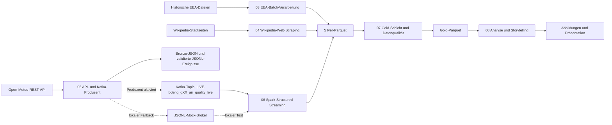

# Euro Air Quality Pipeline

## Kurzbeschreibung

Dieses Repository enthält ein Notebook-basiertes Data-Engineering-Projekt zur Luftqualität in ausgewählten europäischen Städten. Drei unterschiedliche Datenquellen werden in einer nachvollziehbaren Pipeline verbunden:

- historische EEA-Dateien als Datei- und Batch-Quelle
- Wikipedia-Seiten als Web-Scraping-Quelle
- die Open-Meteo Air Quality API als REST-API-Quelle

Kafka dient als zentraler Broker für Live-Ereignisse. Spark Structured Streaming liest diese Ereignisse, validiert das Schema und schreibt transformierte Daten als Parquet-Dateien. Die Analyse bleibt deskriptiv und explorativ. Kausale Aussagen sind nicht vorgesehen.

## Leitfrage

Wie unterscheiden sich PM2.5-, PM10- und NO2-Muster zwischen ausgewählten europäischen Städten, und welchen vorsichtig interpretierbaren Kontext liefern städtische Metadaten?

## Abdeckung der Anforderungen

| Anforderung | Umsetzung |
| --- | --- |
| Mindestens drei unterschiedliche Datenquellen | EEA-Dateien, Wikipedia-Web-Scraping, Open-Meteo-REST-API |
| Datei- oder Datenbankquelle | Notebook `03_eea_batch_ingestion.ipynb` |
| Web-Scraping | Notebook `04_wikipedia_web_scraping.ipynb` |
| REST-API | Notebook `05_open_meteo_api_and_kafka_producer.ipynb` |
| Kafka-Produzent und Topic | Notebook `05_open_meteo_api_and_kafka_producer.ipynb` |
| Spark liest aus Kafka | Notebook `06_spark_structured_streaming_kafka_to_parquet.ipynb` |
| Persistenz transformierter Daten | Silver- und Gold-Parquet-Dateien unter `data/` |
| Visualisierung des Datenflusses | Mermaid-Diagramme unter `docs/diagrams/` |
| Nachvollziehbare Ergebnisgeschichte | Notebook `08_analysis_visualization_and_storytelling.ipynb` und `presentation/` |
| Dokumentation der Arbeitsschritte | Notebooks `00` bis `08` |
| Öffentliches GitHub-Repository | `https://github.com/OnlyMajorG/euro-air-quality-pipeline` |

## Reihenfolge der Notebooks

| Reihenfolge | Notebook | Zweck |
| ---: | --- | --- |
| 00 | `notebooks/00_project_scope_and_requirements.ipynb` | Projektumfang, Anforderungen und Gesamtüberblick |
| 01 | `notebooks/01_source_spike_and_cluster_check.ipynb` | Machbarkeit der Quellen und Infrastrukturprüfung |
| 02 | `notebooks/02_city_reference_model.ipynb` | Stabile Stadt-IDs und Referenzdaten |
| 03 | `notebooks/03_eea_batch_ingestion.ipynb` | Historische EEA-Daten normalisieren und aggregieren |
| 04 | `notebooks/04_wikipedia_web_scraping.ipynb` | Wikipedia-HTML abrufen und Stadtmetadaten extrahieren |
| 05 | `notebooks/05_open_meteo_api_and_kafka_producer.ipynb` | Open-Meteo-Ereignisse erzeugen und an Kafka senden |
| 06 | `notebooks/06_spark_structured_streaming_kafka_to_parquet.ipynb` | Kafka-Ereignisse mit Spark verarbeiten und persistieren |
| 07 | `notebooks/07_gold_layer_and_data_quality.ipynb` | Gold-Datensätze und Qualitätsbericht erzeugen |
| 08 | `notebooks/08_analysis_visualization_and_storytelling.ipynb` | Analysen, Diagramme und Ergebnisgeschichte erstellen |
| Hilfsnotebook | `notebooks/09_reset_data.ipynb` | Lokale Laufzeitdaten kontrolliert zurücksetzen |

## Architektur



## Umsetzungsstatus

| Phase | Status | Hinweis |
| --- | --- | --- |
| 0 bis 4 | Lokal umgesetzt und geprüft | Projektstruktur, Quellen, Stadtmodell, EEA-Batch und Wikipedia-Scraping |
| 5 | Lokal mit Mock-Broker geprüft | Strikter Kafka-Nachweis muss in der FH-Umgebung erfolgen |
| 6 | Implementiert; reduzierter lokaler Strukturtest bestanden | Der lokale Rechner besitzt kein PySpark. Der strikte Kafka-zu-Spark-Nachweis muss in der FH-Umgebung erfolgen |
| 7 | Lokal geprüft | Gold-Datensätze und Qualitätsbericht werden erzeugt |
| 8 | Lokal mit kontrollierten Fallback-Daten geprüft | Finale empirische Aussagen erfordern reale EEA-Daten |

## Datenquellen

| Quelle | Typ | Aufgabe |
| --- | --- | --- |
| Historische EEA-Luftqualitätsdaten | Datei und Batch | Historische PM2.5-, PM10- und NO2-Messungen |
| Wikipedia-Stadtseiten | Web-Scraping | Kontextdaten wie Bevölkerung, Fläche und Bevölkerungsdichte |
| Open-Meteo Air Quality API | REST-API | Aktuelle oder zeitnahe Luftqualitätsereignisse für den Kafka-Pfad |

## Technologie-Stack

Python, Jupyter Notebook, Pandas, Requests, BeautifulSoup, Kafka, Spark Structured Streaming, Parquet, Matplotlib und Mermaid.

## Repository-Struktur

```text
notebooks/     geordnete, ausführbare Projektdokumentation
data/          lokale Laufzeitdaten; versioniert werden nur .gitkeep-Dateien
docs/          Architektur, Entscheidungen, Einschränkungen und QA-Nachweise
presentation/  Storyline, Präsentationsstruktur und erzeugte Abbildungen
```

## Installation

### Voraussetzungen

- Python 3.11 oder 3.12 empfohlen
- Java 17 oder 21 für lokale PySpark-Ausführungen
- Jupyter Notebook oder JupyterLab
- Netzwerkzugriff für Open-Meteo und Wikipedia
- Zugriff auf Kafka und Spark für den strikten FH-Nachweislauf

Unter Windows benötigen lokale Spark-Dateizugriffe kompatible Hadoop-Binärdateien über `HADOOP_HOME` oder eine Linux-basierte Laufzeitumgebung wie WSL oder Docker.

### Windows PowerShell

```powershell
python -m venv .venv
.venv\Scripts\Activate.ps1
python -m pip install --upgrade pip
python -m pip install -r requirements.txt
Copy-Item .env.example .env
jupyter notebook
```

## Konfiguration

Die lokale `.env` wird nicht versioniert. Sichere Vorlagen stehen in `.env.example` und `.env.cluster.example`.

```env
KAFKA_BOOTSTRAP_SERVERS=<fh-kafka-broker-host>:9092
KAFKA_TOPIC_AIR_QUALITY_LIVE=LIVE-bdeng_gXX_air_quality_live
KAFKA_MODE=auto
ALLOW_KAFKA_MOCK_FALLBACK=true
SPARK_KAFKA_MODE=auto
ALLOW_SPARK_KAFKA_MOCK_FALLBACK=true
RUN_OPEN_METEO_KAFKA_PRODUCER=false
```

Für lokale Durchläufe bleibt `RUN_OPEN_METEO_KAFKA_PRODUCER=false`. Notebook `05` verwendet dann einen klar gekennzeichneten JSONL-Mock-Broker.

Für den strikten FH-Nachweislauf:

```env
KAFKA_MODE=kafka
ALLOW_KAFKA_MOCK_FALLBACK=false
ALLOW_CONTROLLED_OPEN_METEO_FALLBACK=false
RUN_OPEN_METEO_KAFKA_PRODUCER=true
SPARK_KAFKA_MODE=kafka
ALLOW_SPARK_KAFKA_MOCK_FALLBACK=false
```

Notebook `06` verwendet bevorzugt Kafka und Spark Structured Streaming. Ist PySpark lokal nicht installiert, prüft der sichtbar gekennzeichnete Modus `pandas_mock_no_pyspark` ausschließlich Ereignisvertrag, Qualitätsregeln, Joins und Parquet-Übergaben. Dieser reduzierte Pfad ist weder ein Spark- noch ein Kafka-Nachweis.

Notebook `07` schreibt Gold-Parquet-Dateien lokal und hält die Herkunft des Live-Snapshots explizit fest. Der Modus `phase6_pandas_mock_no_pyspark_silver` bleibt in den Ausgaben sichtbar.

## Ausführungsplan

1. Notebooks `00` und `01` ausführen und Rahmenbedingungen prüfen.
2. Notebook `02` für die Stadtreferenz ausführen.
3. Notebook `03` vor finalen Aussagen mit einem realen EEA-Extrakt ausführen.
4. Notebook `04` für die Wikipedia-Metadaten ausführen.
5. Notebook `05` für Open-Meteo-Ereignisse und den Kafka-Produzenten ausführen.
6. Notebook `06` für den Spark-Kafka-Pfad ausführen.
7. Notebook `07` für Gold-Datensätze und Qualitätsbericht ausführen.
8. Notebook `08` für Analyse, Diagramme und Storytelling ausführen.

Notebook `09` ist optional. Standardmäßig gilt `DRY_RUN=true`. Eine Löschung erfordert `DRY_RUN=false`. Für externe Datenpfade ist zusätzlich `ALLOW_EXTERNAL_DATA_RESET=true` notwendig.

## Geplante Ergebnisgeschichte

Die Abschlusspräsentation vergleicht historische PM2.5-, PM10- und NO2-Muster in acht europäischen Städten. Sie zeigt schadstoffspezifische Rangfolgen und untersucht explorativ, ob Kontextdaten wie die Bevölkerungsdichte helfen, beobachtete Unterschiede einzuordnen. Ein separater Open-Meteo-Snapshot demonstriert den Live-Pfad über Kafka und Spark, ohne aktuelle API-Werte mit historischen EEA-Aussagen zu vermischen.

## Finale Abbildungen

| Abbildung | Zweck |
| --- | --- |
| `presentation/figures/pm25_city_ranking.png` | Historischer PM2.5-Städtevergleich |
| `presentation/figures/pollutant_comparison.png` | Getrennter Vergleich von PM2.5, PM10 und NO2 |
| `presentation/figures/selected_city_timeseries.png` | Ausgewählte PM2.5-Tageswerte ohne Interpolation |
| `presentation/figures/pollutant_distribution.png` | PM2.5-Verteilungen mit sichtbaren Ausreißern |
| `presentation/figures/density_vs_air_quality.png` | Explorative, nicht kausale Einordnung der Bevölkerungsdichte |
| `presentation/figures/live_air_quality_snapshot.png` | Getrennter Open-Meteo-Live-Snapshot |

## Nicht versionierte Dateien

Erzeugte CSV-, JSON-, HTML-, Parquet- und Checkpoint-Dateien unter `data/` bleiben lokal. `.gitkeep`-Dateien erhalten die benötigte Ordnerstruktur. Geheimnisse und lokale `.env`-Dateien werden ebenfalls nicht versioniert.

## Einschränkungen

Das Projekt ist keine Produktionsplattform. Die Datenmenge ist überschaubar, die Analyse bleibt explorativ und Wikipedia-Metadaten können sich ändern. Aussagen über Kafka und Spark sind erst nach dem strikten FH-Nachweislauf zulässig. Finale empirische Aussagen erfordern reale EEA-Daten.
