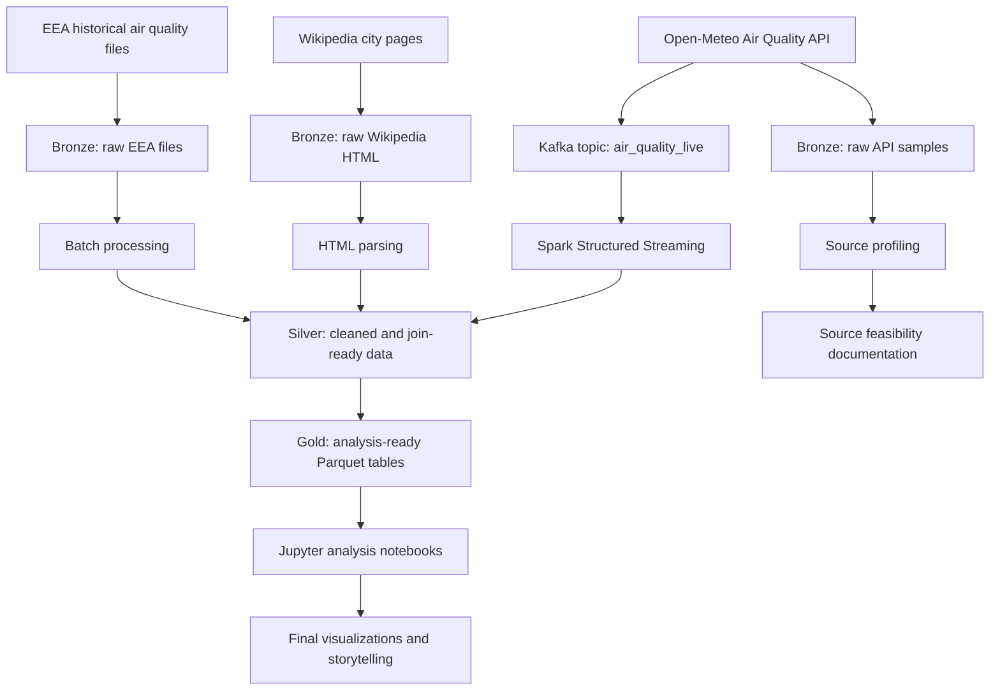
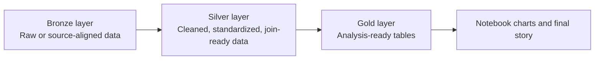
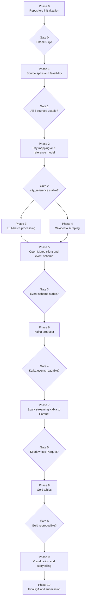
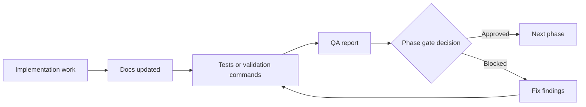

# euro-air-quality-pipeline

Reproducible Big Data Engineering project for analyzing air quality patterns
across selected European cities.

This repository is built as a university Big Data Engineering project. The
focus is not a production platform or a machine learning model. The focus is a
clear, testable, documented data engineering pipeline that combines batch data,
web metadata, REST API data, Kafka, Spark Structured Streaming, Parquet storage,
Jupyter notebooks, and final storytelling.

## Current Status

**Current phase:** Phase 2 in progress

**Latest QA decision:** Phase 1 QA approved the project for Phase 2. Phase 2 is
currently limited to City Mapping and Reference Model work; the Phase 2 gate has
not been reviewed yet.

At the current state, the repository contains the Phase 0 skeleton, Phase 1
source feasibility documentation for Open-Meteo, EEA, and Wikipedia, and Phase
2 city reference work through Open-Meteo mapping documentation. The
deterministic city reference builder and validation tests exist. It does
**not** yet contain full EEA ingestion, a production Wikipedia scraper,
Open-Meteo client behavior, Kafka producer logic, Spark processing, Gold tables,
or analysis results.

## Guiding Question

Which air quality patterns can be identified across selected European cities
when historical air quality data, current API data, and urban context metadata
are combined in a reproducible Big Data Engineering pipeline?

## Core Scope

The approved core scope combines:

| Requirement | Project implementation |
| --- | --- |
| File or batch source | EEA historical air quality data |
| Web scraping source | Wikipedia city pages and city metadata |
| REST API source | Open-Meteo Air Quality API |
| Message broker | Kafka topic for Open-Meteo live or near-live data |
| Stream processing | Spark Structured Streaming reads from Kafka |
| Persistent storage | Parquet in Bronze, Silver, and Gold layers |
| Documentation and exploration | Ordered Jupyter notebooks |
| Final output | Visualizations and storytelling |

Core pollutants are limited to future PM2.5, PM10, and NO2 scope unless a later
approved decision changes that.

## Non-Goals

The following are intentionally out of scope unless the core project is complete
and a later decision explicitly approves them:

- PostgreSQL
- Airflow
- dbt
- Cloud deployment
- CI/CD platform work
- Dashboard frameworks
- Machine learning models
- Causal analysis
- Extra pollutants beyond the approved core pollutants
- Production-grade streaming infrastructure

## Target Architecture



## Data Layer Design



| Layer | Purpose | Examples |
| --- | --- | --- |
| Bronze | Preserve source-aligned raw data and source evidence. | EEA raw samples, Wikipedia HTML, Open-Meteo raw JSON |
| Silver | Normalize fields and prepare reliable joins. | city reference, city metadata, cleaned source tables |
| Gold | Provide reproducible analysis datasets. | rankings, daily summaries, latest live air quality table |

## Repository Structure

```text
euro-air-quality-pipeline/
|-- README.md
|-- docker-compose.yml
|-- requirements.txt
|-- .env.example
|-- .gitignore
|-- docs/
|   |-- architecture.md
|   |-- data_sources.md
|   |-- data_model.md
|   |-- decisions/
|   |-- diagrams/
|   |-- implementation/
|   |-- qa/
|   `-- status/
|-- notebooks/
|-- src/
|-- tests/
|-- data/
`-- presentation/
```

### Important Folders

| Folder | Purpose |
| --- | --- |
| `docs/` | Architecture, source documentation, data model, ADRs, QA reports, status, and implementation notes. |
| `notebooks/` | Ordered phase documentation and exploration notebooks. |
| `src/` | Python package structure for later implementation. Currently placeholders only. |
| `tests/` | Placeholder tests now; future parser, schema, and mapping tests later. |
| `data/` | Empty Bronze/Silver/Gold/checkpoint scaffold preserved with `.gitkeep`. Real/generated data is ignored. |
| `presentation/` | Final storyline and figure output location for later phases. |
| `project-resources/` | Local planning and course resources. Ignored by git. |
| `agents/` | Local AI-agent working instructions and memory. Ignored by git. |

## Notebook Guide

The notebooks are the main readable execution trail. Each notebook has a
specific role and must stay aligned with the project phase.

| Order | Notebook | Phase | Purpose |
| ---: | --- | --- | --- |
| 00 | `notebooks/00_project_scope_and_sources.ipynb` | Phase 0-1 | Project scope, source overview, pilot source feasibility checks. |
| 01 | `notebooks/01_city_mapping.ipynb` | Phase 2 | City reference model, `city_id`, coordinates, and source join strategy. |
| 02 | `notebooks/02_eea_batch_ingestion.ipynb` | Phase 3 | EEA batch data inspection and later batch ingestion documentation. |
| 03 | `notebooks/03_wikipedia_scraping.ipynb` | Phase 4 | Wikipedia HTML inspection, parsing strategy, and metadata extraction notes. |
| 04 | `notebooks/04_kafka_producer_demo.ipynb` | Phase 5-6 | Open-Meteo event schema and Kafka producer demonstration once those phases are active. |
| 05 | `notebooks/05_spark_streaming_processing.ipynb` | Phase 7 | Spark Structured Streaming from Kafka to Parquet. |
| 06 | `notebooks/06_analysis_and_visualization.ipynb` | Phase 8-9 | Gold table analysis, visualizations, and final storytelling. |

Notebook rules:

- Do not commit large outputs.
- Do not store secrets in notebooks.
- Do not use notebooks to hide unreviewed pipeline logic.
- Each notebook must explain inputs, outputs, assumptions, and limitations.
- A notebook may only implement work for its active phase.

## Phase Plan



### Phase 0 - Repository Initialization And Scope Freeze

Goal: create a clean professional project skeleton.

Allowed work:

- Repository structure.
- README, docs, ADRs, diagrams.
- Placeholder notebooks, source modules, and tests.
- Empty data folder scaffold.
- `.gitignore`, `.env.example`, `requirements.txt`, and Docker Compose baseline.

Not allowed:

- Real data ingestion.
- API calls.
- Web scraping.
- Kafka producer implementation.
- Spark business logic.

Exit criteria:

- Phase 0 QA report exists.
- No critical findings.
- Notebook files are structurally valid.
- Repository still contains no real data or secrets.

### Phase 1 - Source Spike And Feasibility Check

Status: **complete**

Goal: prove that all three planned data sources are technically usable before
building the pipeline.

Planned checks:

- Test Open-Meteo API for two pilot cities.
- Check EEA availability for two pilot cities and at least one pollutant.
- Fetch and inspect Wikipedia HTML for two pilot cities.
- Document formats, fields, timestamps, risks, and decisions.

Completed deliverables:

- Updated `notebooks/00_project_scope_and_sources.ipynb`.
- Updated `docs/data_sources.md`.
- Local ignored Open-Meteo JSON evidence samples.
- Local ignored Wikipedia HTML infobox evidence samples.
- EEA metadata-level feasibility notes.
- Phase 1 QA report in `docs/qa/phase1_qa_report.md`.

Exit criteria:

- Every source is classified as `usable`, `usable with constraints`, or
  `not usable`.
- Risks are documented.
- No full ingestion pipeline exists yet.

### Phase 2 - City Mapping And Reference Model

Goal: create the central city reference model for joining all sources.

Current status: **in progress through Open-Meteo mapping documentation**

Implemented so far:

- Exactly 8 starter cities.
- Canonical city reference schema.
- Deterministic local city reference builder.
- Local generated `data/silver/city_reference.csv` and
  `data/silver/city_reference.parquet` when explicitly called; both remain
  ignored by Git.
- Validation tests for required fields, join keys, normalized names, country
  codes, coordinates, duplicate IDs, minimum city count, and Parquet readback.
- EEA station-to-city mapping strategy.
- Wikipedia metadata join and null-handling rules.
- Open-Meteo coordinate, pollutant field, and UTC timezone mapping rules.

Planned remaining output:

- Remaining Phase 2 QA and gate decision.

Exit criteria:

- City reference can be read reproducibly.
- No downstream code joins on free-text city names.
- Mapping assumptions are documented.

### Phase 3 - EEA Batch Data Processing

Goal: process historical EEA file or batch data into source-aligned and cleaned
Parquet outputs.

Planned output:

- EEA source inspection.
- Bronze evidence.
- Silver daily city/pollutant table.
- Documentation of timestamp, pollutant, unit, station, and measurement fields.

Exit criteria:

- EEA processing is reproducible.
- City mapping is used.
- Methodological limitations are documented.

### Phase 4 - Wikipedia Scraping And Metadata Extraction

Goal: extract city metadata from Wikipedia in a controlled and documented way.

Planned output:

- Raw HTML handling.
- Parser for selected metadata fields.
- Silver city metadata.
- Parser tests.

Exit criteria:

- Raw HTML is preserved or reproducibly fetchable according to data policy.
- Parser behavior is tested.
- Missing or inconsistent fields are handled explicitly.

### Phase 5 - Open-Meteo Client And Event Schema

Goal: build the Open-Meteo API client and define a stable event schema before
Kafka is introduced.

Planned output:

- Open-Meteo request logic.
- Schema for PM2.5, PM10, and NO2 events.
- Validation tests for required fields and value types.

Exit criteria:

- Event schema is documented.
- Client does not perform network calls on import.
- Tests cover normal and missing-value cases.

### Phase 6 - Kafka Producer

Goal: publish valid Open-Meteo events to Kafka.

Planned output:

- Kafka topic `air_quality_live`.
- Minimal Open-Meteo live producer.
- Producer demonstration notebook.
- Evidence that messages can be consumed.

Exit criteria:

- Producer writes schema-valid events.
- Kafka topic is documented.
- Rate limits and failure behavior are controlled.

### Phase 7 - Spark Structured Streaming From Kafka To Parquet

Goal: make Spark read Kafka data, parse JSON, transform it, and write Parquet.

Planned output:

- Spark Structured Streaming job.
- Explicit schema parsing.
- Join with city metadata.
- Checkpointed Parquet output.

Exit criteria:

- Spark actually reads from Kafka.
- Processing is more than copy-through.
- Output and checkpoint locations are documented.

### Phase 8 - Gold Layer And Analysis Datasets

Goal: build analysis-ready datasets from Silver and streaming outputs.

Planned output:

- Reproducible Gold table builder.
- Gold datasets for city summaries, pollutant rankings, and context joins.
- Documentation of historical versus current data context.

Exit criteria:

- Gold tables are reproducible.
- Charts can be generated from Gold or clearly documented Silver data.
- No unsupported causal claims are introduced.

### Phase 9 - Visualization And Storytelling

Goal: create a clear final story that connects pipeline design with air quality
patterns.

Planned output:

- 4-5 core charts.
- Final storyline.
- Figures under `presentation/figures/`.
- Notebook-based reproduction.

Exit criteria:

- Visualizations are based on reproducible datasets.
- Claims are descriptive, not causal.
- The story is explainable in a short presentation.

### Phase 10 - Final Documentation, QA And Submission Readiness

Goal: make the repository reviewable, reproducible, and submission-ready.

Planned output:

- Final README.
- Final QA report.
- Final notebooks.
- Final diagrams.
- Final presentation storyline.

Exit criteria:

- A fresh reviewer can understand the project within minutes.
- Setup instructions are tested.
- All BDENG requirements are traceable to artifacts.
- No large data files, secrets, or optional-scope dependencies are required.

## BDENG Requirement Mapping

| BDENG requirement | Evidence or planned artifact |
| --- | --- |
| At least three data sources | EEA, Wikipedia, and Open-Meteo feasibility documented in `docs/data_sources.md`. |
| File or database source | EEA historical source validated at metadata level in Phase 1; batch implementation planned for Phase 3. |
| Web scraping source | Wikipedia HTML feasibility validated in Phase 1; production parser planned for Phase 4. |
| REST API source | Open-Meteo API feasibility validated in Phase 1; reusable client and event schema planned for Phase 5. |
| Kafka producer and topic | Phase 6 producer and `air_quality_live` topic |
| Spark reads from Kafka | Phase 7 Spark Structured Streaming job |
| Persistent transformed output | Parquet Bronze/Silver/Gold |
| Data flow visualization | Mermaid diagrams in README and `docs/diagrams/` |
| Jupyter documentation | Ordered notebooks 00-06 |
| Final visualization and storytelling | Notebook 06 and `presentation/final_storyline.md` |

## Documentation And QA Model



Documentation locations:

| Path | Role |
| --- | --- |
| `docs/architecture.md` | Architecture notes and decisions. |
| `docs/data_sources.md` | Source feasibility, fields, risks, and decisions. |
| `docs/data_model.md` | City reference, source schemas, and Gold table design. |
| `docs/decisions/` | ADRs for durable technical decisions. |
| `docs/diagrams/` | Mermaid diagram files. |
| `docs/implementation/` | Step-by-step implementation notes. |
| `docs/qa/` | Phase QA reports and readiness checks. |
| `docs/status/` | Current status, phase gates, and project log. |

## Local Setup And Inbetriebnahme

Use this sequence for a clean local setup. The commands prepare the repository
for validation and notebook work. They do not start the pipeline and do not
download project datasets.

### 1. Clone Repository

```bash
git clone <repo-url>
cd euro-air-quality-pipeline
```

### 2. Create Virtual Environment

Windows PowerShell:

```powershell
python -m venv .venv
.\.venv\Scripts\Activate.ps1
python -m pip install --upgrade pip
```

Linux/macOS:

```bash
python -m venv .venv
source .venv/bin/activate
python -m pip install --upgrade pip
```

### 3. Install Python Dependencies

```bash
pip install -r requirements.txt
```

### 4. Create Local Environment File

Windows PowerShell:

```powershell
Copy-Item .env.example .env
```

Linux/macOS:

```bash
cp .env.example .env
```

The `.env` file is local only and must not be committed.

### 5. Validate Repository Without Starting Services

```bash
python -m pytest
docker compose config
```

If `python -m pytest` fails with `No module named pytest`, the active virtual
environment is not prepared correctly or dependencies were not installed into
the active interpreter.

### 6. Start Jupyter Only When Needed

The notebook server is useful for documentation and source-spike work:

```bash
docker compose up jupyter
```

Then open the URL printed by Jupyter in the terminal. Stop the service with
`Ctrl+C` when done.

### 7. Kafka And Spark Services

Kafka and Spark are part of the planned core project, but they should only be
started when the active phase requires them.

Allowed later-phase command pattern:

```bash
docker compose up kafka spark
```

Do not start Kafka or Spark during Phase 0 cleanup, Phase 1 source feasibility,
or Phase 2 city mapping unless an issue explicitly requires a Docker service
check.

### 8. Current Phase 2 Workflow

For Phase 2, the expected local workflow is:

```bash
python -m pytest
python -m src.city_mapping.build_city_reference
docker compose config
jupyter notebook notebooks/01_city_mapping.ipynb
```

Phase 2 may build the city reference model and related validation tests. It
must not implement full EEA ingestion, the production Wikipedia scraper, Kafka,
Spark, Gold tables, or final analytics.

## Data And Secret Hygiene

- Do not commit `.env`.
- Do not commit API tokens, credentials, or personal machine paths.
- Do not commit large raw datasets.
- Do not commit generated Parquet, CSV, JSON, HTML, or checkpoint files unless a
  later documented data policy explicitly allows a tiny evidence sample.
- Keep empty data folders with `.gitkeep`.
- Keep notebook outputs small.

## Review Expectations

A reviewer should be able to verify:

1. The active phase is clear.
2. Documentation matches the repository state.
3. No future-phase work is presented as completed.
4. All data sources and technologies map to BDENG requirements.
5. Scope creep is rejected or explicitly deferred.
6. Every phase has evidence, tests, and a gate decision before the next phase.

## License

License to be defined.
