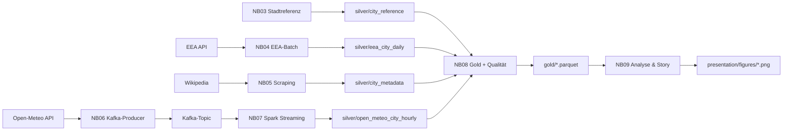

# Euro Air Quality Pipeline

> Ein Notebook-basiertes Data-Engineering-Projekt zur Luftqualität in acht europäischen Großstädten —
> von der Rohdatenquelle bis zur nachvollziehbaren Ergebnisgeschichte.

---

## Worum geht es?

Das Projekt untersucht **PM2.5, PM10 und NO2** in Wien, Berlin, Paris, Madrid, Rom, Amsterdam,
Warschau und Prag. Im Mittelpunkt steht ein sauberes, nachvollziehbares **Data-Engineering-Setup**:
Daten aus drei verschiedenartigen Quellen holen, über **Kafka** und **Spark** verarbeiten, in einer
**Medallion-Architektur** (Bronze → Silver → Gold) speichern und am Ende eine ehrliche, deskriptive
Ergebnisgeschichte erzählen.

**Leitfrage:** Wie unterscheiden sich PM2.5-, PM10- und NO2-Muster zwischen den Städten, und welchen
vorsichtig interpretierbaren Kontext liefern städtische Metadaten (z. B. Bevölkerungsdichte)?

### Die drei Datenquellen

| Quelle | Typ | Liefert |
| --- | --- | --- |
| **EEA Downloads API** | Datei/Datenbank (Parquet → PostgreSQL bzw. Parquet) | Historische, gemessene Schadstoffwerte (Standard: ein Jahr) |
| **Wikipedia** | Web-Scraping (HTML) | Bevölkerung, Fläche, Bevölkerungsdichte je Stadt |
| **Open-Meteo Air Quality API** | REST-API (JSON) | Aktuelle Live-Werte als Kafka-/Spark-Nachweis |

---

## Medallion-Architektur und Datenfluss



- **Bronze — Rohdaten:** quelltreu gespeichert (PostgreSQL/Parquet, HTML, JSON). Nichts wird verändert.
- **Silver — bereinigt:** validiert, einheitliches Schema, über `city_id` verknüpfbar (Parquet).
- **Gold — analysebereit:** aggregierte Tabellen und Rangfolgen, die Notebook `09` direkt visualisiert.

---

## Zwei Ausführungsumgebungen

Welche Umgebung gilt, steht allein in der `.env` (`EXECUTION_ENV`). Es gibt **keine** Auto-Erkennung im Code.

| Merkmal | Lokal (Docker) | FH-JupyterHub |
| --- | --- | --- |
| `EXECUTION_ENV` | `docker_compose` | `fh_jupyterhub` |
| Infrastruktur | `docker compose` (Kafka, Spark, PostgreSQL, Jupyter) | bereits auf der FH vorhanden |
| EEA-Bronze (`EEA_BRONZE_STORAGE_MODE`) | `postgres` | `parquet` (FH hat kein PostgreSQL) |
| Spark (`SPARK_MASTER_URL`) | `spark://spark-master:7077` | `local[*]` |
| Kafka (`KAFKA_BOOTSTRAP_SERVERS`) | `kafka:29092` | FH-Broker |

Vorlagen: `.env.example` (lokaler Host), `.env.docker.example` (vom Container automatisch genutzt),
`.env.cluster.example` (FH). Eine davon nach `.env` kopieren und anpassen.

---

## Jupyter-Kernel erstellen

In den Root-Ordner des Projekts wechseln.

- Windows

``` cmd
python -m venv .venv
```

``` cmd
.venv\Scripts\activate
```

``` cmd
pip install -r requirements.txt
```

``` cmd
python -m ipykernel install --user --name=.venv --display-name "Euro Air Quality Pipeline"
```

- Linux/macOS


``` bash
python -m venv .venv
```
``` bash
source .venv/bin/activate
```
``` bash
pip install -r requirements.txt
```
``` bash
python -m ipykernel install --user --name=.venv --display-name "Euro Air Quality Pipeline"
```


---

## Inbetriebnahme (lokal mit Docker)

**Voraussetzung:** Docker Desktop läuft; Python mit den Paketen aus `requirements.txt`.

1. **Notebook `00` ausführen** — startet `docker compose up -d --build` und wartet, bis Kafka, Spark,
   PostgreSQL und Jupyter erreichbar sind.
2. **http://localhost:8888 öffnen** und dort die Notebooks **`01` bis `09`** der Reihe nach ausführen.
   Notebook `07` (Spark Structured Streaming) muss im Docker-Jupyter laufen, da es den
   Spark-Kafka-Connector und Java 17 benötigt.
3. **Notebook `10`** setzt am Ende die Daten zurück und fährt die Infrastruktur herunter.

> Der EEA-Standardzeitraum ist ein **volles Jahr** und kann beim ersten Abruf einige Minuten dauern.
> Für einen kürzeren Testlauf einfach `EEA_DATE_END` in der `.env` näher an `EEA_DATE_START` setzen.

## Inbetriebnahme (FH-JupyterHub)

1. `.env.cluster.example` nach `.env` kopieren, FH-Broker und Gruppentopic eintragen.
2. Notebook `00` prüft die Erreichbarkeit des FH-Kafka (kein Docker).
3. Notebooks `01`–`09` im FH-Kernel ausführen, `10` zum Aufräumen.

---

## Notebook-Übersicht

| NB | Datei | Inhalt |
| --- | --- | --- |
| `00` | `00_infrastructure_startup` | Infrastruktur hochfahren (Docker) bzw. FH-Erreichbarkeit prüfen |
| `01` | `01_project_scope_and_requirements` | Projektumfang, Leitfrage, Anforderungs-Mapping |
| `02` | `02_source_spike_and_cluster_check` | Erreichbarkeit der Quellen und der Infrastruktur |
| `03` | `03_city_reference_model` | Stadtkatalog (`city_id`) als gemeinsame Grundlage |
| `04` | `04_eea_batch_ingestion` | EEA-Messwerte → Bronze (PostgreSQL/Parquet) → Silver-Tageswerte |
| `05` | `05_wikipedia_web_scraping` | Wikipedia-Stadtseiten → Silver-Metadaten |
| `06` | `06_open_meteo_api_and_kafka_producer` | Open-Meteo REST-API → Events → Kafka-Producer |
| `07` | `07_spark_structured_streaming_kafka_to_parquet` | Spark liest aus Kafka → Silver-Parquet |
| `08` | `08_gold_layer_and_data_quality` | 5 Gold-Tabellen + Qualitätsbericht |
| `09` | `09_analysis_visualization_and_storytelling` | Analyse, 6 Abbildungen, Ergebnisgeschichte |
| `10` | `10_reset_data` | Daten löschen und Infrastruktur herunterfahren |

### Abdeckung der Projektanforderungen

| Anforderung | Notebook |
| --- | :---: |
| Datei- oder Datenbankquelle | 04 (EEA → PostgreSQL/Parquet) |
| Web-Scraping | 05 (Wikipedia) |
| REST-API | 06 (Open-Meteo) |
| Kafka-Producer und Topic | 06 |
| Spark liest aus Kafka | 07 |
| Persistenz transformierter Daten | 03–08 (Silver/Gold-Parquet) |
| Visualisierung des Datenflusses | README-Diagramm, `docs/diagrams/` |
| Ergebnisgeschichte (Storytelling) | 09 |
| Dokumentation der Schritte | jedes Notebook |

---

## Datenbereinigung

| Notebook | Schicht | Maßnahme |
| --- | --- | --- |
| **04 EEA** | Bronze→Silver | `Validity > 0`, `Verification > 0`, `Value >= 0`, Datumsfenster; danach Tagesaggregation |
| **05 Wikipedia** | Bronze→Silver | `clean_number()` (Fußnoten/Trennzeichen entfernen); `parse_status` dokumentiert Erfolg; fehlende Werte bleiben leer |
| **06 Open-Meteo** | Bronze | `event_id = SHA256(...)` deterministisch (dedup-fähig); versionierter Event-Vertrag |
| **07 Spark** | Kafka→Silver | `from_json()` mit explizitem Schema; `schema_version`/`source`-Prüfung; Plausibilitätsbereiche; `dropDuplicates(["event_id"])`; Join auf `city_reference` |
| **08 Gold** | Silver→Gold | Trennung `dataset_context` (`eea_historical`/`open_meteo_live`) |

Der EEA-Filter `Validity > 0` / `Verification > 0` lässt nur formal geprüfte Messungen zu — das ist
korrekte Qualitätssicherung, kein Datenverlust.

---

## Technologie-Stack

| Schicht | Technologie | Zweck |
| --- | --- | --- |
| Notebooks | Jupyter | Ausführbare Dokumentation |
| Datenverarbeitung | pandas | Tabellentransformationen |
| Abruf/Parsing | requests, BeautifulSoup | REST-API, HTML-Scraping |
| Datenbank | PostgreSQL 17 (lokal) | EEA-Bronze |
| Streaming | Apache Kafka 3.9 + `confluent-kafka` | Event-Broker und Producer |
| Stream-Verarbeitung | Apache Spark 3.5 (Structured Streaming) | Kafka → Parquet |
| Speicherformat | Apache Parquet | Silver und Gold |
| Visualisierung | Matplotlib | Abbildungen in NB 09 |
| Container | Docker Compose | Lokale Infrastruktur |

---

## Wichtige `.env`-Variablen

| Variable | Beispiel | Bedeutung |
| --- | --- | --- |
| `EXECUTION_ENV` | `docker_compose` / `fh_jupyterhub` | Wählt die Umgebung |
| `SPARK_MASTER_URL` | `spark://spark-master:7077` / `local[*]` | Spark-Einstiegspunkt |
| `SPARK_KAFKA_CONNECTOR_PACKAGE` | `org.apache.spark:spark-sql-kafka-0-10_2.12:3.5.7` | Kafka-Connector (FH: leer) |
| `KAFKA_BOOTSTRAP_SERVERS` | `kafka:29092` | Kafka-Broker |
| `KAFKA_TOPIC_AIR_QUALITY_LIVE` | `air_quality_live` | Live-Topic |
| `EEA_BRONZE_STORAGE_MODE` | `postgres` / `parquet` | EEA-Bronze-Backend |
| `POSTGRES_DSN` | `postgresql://…@postgres:5432/…` | nur im Postgres-Modus |
| `EEA_DATE_START` / `EEA_DATE_END` | `2025-01-01` / `2026-01-01` | EEA-Zeitraum (Default 365 Tage) |

Das sind alle Konfigurationswerte — neun Variablen, die sich zwischen lokaler Docker- und FH-Umgebung
unterscheiden. Es gibt keine weiteren Schalter oder Modi.

---

## Repository-Struktur

```text
euro-air-quality-pipeline/
├── notebooks/        00–10, geordnete ausführbare Dokumentation
├── data/             Laufzeitdaten (bronze/silver/gold, nicht versioniert)
├── presentation/figures/   Abbildungen aus NB 09
├── docs/             Architektur, Datenquellen, Entscheidungen (ADR)
├── docker/           jupyter.Dockerfile, requirements-docker.txt
├── docker-compose.yml
├── requirements.txt
└── .env.example / .env.docker.example / .env.cluster.example
```

---

## Bekannte Einschränkungen

- Akademischer Nachweis, keine Produktionsplattform.
- Open-Meteo-Werte sind **Modelldaten**, keine Messwerte — getrennt von den EEA-Messungen zu lesen.
- Die EEA-Stationsabdeckung ist nicht für jede Stadt vollständig; einzelne Schadstoffe können fehlen.
  **Rom** hat z. B. keine validierten PM2.5/PM10-Werte — die Lücke wird offen als `<NA>` ausgewiesen
  (nicht als `0`, nicht interpoliert).
- Bevölkerungsdichte ist **kein** Erklärungsfaktor: Der Zusammenhang zur PM2.5-Belastung ist nicht
  robust (r ≈ −0,23 über alle Städte, ≈ −0,95 ohne das nicht vergleichbare **Paris**, das als
  Kernkommune abgegrenzt ist — Modifiable Areal Unit Problem, markiert über `density_comparable`).
- Alle Aussagen in NB 09 sind **deskriptiv und explorativ** (keine Kausalität, keine universelle Rangliste).
- Der FH-Pfad ist code-seitig vorbereitet; getestet wurde der lokale Docker-Pfad.
