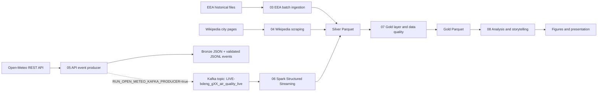
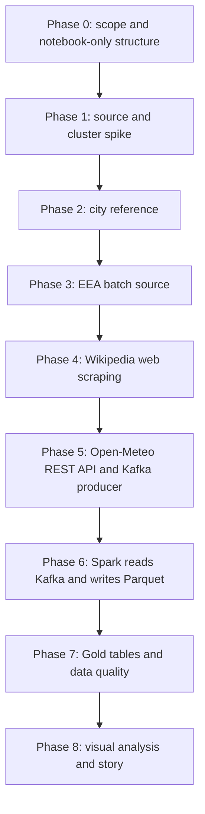

# euro-air-quality-pipeline

## Executive Summary

This repository contains a notebook-only Big Data Engineering project about European air quality patterns across selected cities. The project combines one file/batch source, one web scraping source, and one REST API source, then uses Kafka and Spark Structured Streaming to demonstrate a full data-flow from source acquisition to Parquet outputs and final storytelling.

The implementation deliverables are ordered Jupyter notebooks. Supporting documentation, Mermaid diagrams, data folders, and presentation notes remain in the repository, but `src/` and `tests/` are intentionally not used as the primary implementation and QA layers.

## Guiding Question

How do PM2.5, PM10, and NO2 air-quality patterns differ across selected European cities, and what context can city metadata add to the interpretation?

## Official Requirement Mapping

| Course requirement | Planned implementation |
| --- | --- |
| At least three data sources | EEA file/batch, Wikipedia web scraping, Open-Meteo REST API |
| File or database source | `03_eea_batch_ingestion.ipynb` |
| Web scraping source | `04_wikipedia_web_scraping.ipynb` |
| REST API source | `05_open_meteo_api_and_kafka_producer.ipynb` |
| Kafka producer and topic | `05_open_meteo_api_and_kafka_producer.ipynb` |
| Spark reads from Kafka | `06_spark_structured_streaming_kafka_to_parquet.ipynb` |
| Store transformed results | Silver and Gold Parquet files under `data/` |
| Visualize data flow | `docs/diagrams/` and `08_analysis_visualization_and_storytelling.ipynb` |
| Tell a coherent story | `08_analysis_visualization_and_storytelling.ipynb` and `presentation/` |
| Document each step in notebooks | Notebooks `00` through `08` |

## Notebook Execution Order

| Order | Notebook | Purpose |
| ---: | --- | --- |
| 00 | `notebooks/00_project_scope_and_requirements.ipynb` | Scope, requirements, non-goals, and full pipeline overview |
| 01 | `notebooks/01_source_spike_and_cluster_check.ipynb` | Source feasibility and FH cluster connectivity notes |
| 02 | `notebooks/02_city_reference_model.ipynb` | Stable city IDs and city reference Parquet |
| 03 | `notebooks/03_eea_batch_ingestion.ipynb` | Historical EEA batch normalization and daily Silver Parquet |
| 04 | `notebooks/04_wikipedia_web_scraping.ipynb` | Wikipedia HTML fetch, parsing, and city metadata Parquet |
| 05 | `notebooks/05_open_meteo_api_and_kafka_producer.ipynb` | Open-Meteo API events and Kafka producer |
| 06 | `notebooks/06_spark_structured_streaming_kafka_to_parquet.ipynb` | Spark Structured Streaming from Kafka to Parquet |
| 07 | `notebooks/07_gold_layer_and_data_quality.ipynb` | Gold tables and cross-table quality checks |
| 08 | `notebooks/08_analysis_visualization_and_storytelling.ipynb` | Visualizations, figures, interpretation, and final story |

## Architecture





## Current Implementation Status

| Phase | Status | Evidence |
| --- | --- | --- |
| Phase 0: Notebook-only refactor | Complete | Target structure, ADRs, README, `.env` templates, `.gitignore`, archive notes |
| Phase 1: Source spike and cluster check | Implemented as guarded notebook | `01_source_spike_and_cluster_check.ipynb` contains Open-Meteo, Wikipedia, EEA and cluster checks |
| Phase 2: City reference model | Implemented | `02_city_reference_model.ipynb` builds, validates and writes `city_reference.csv` and `city_reference.parquet` |
| Phase 3: EEA batch ingestion | Implemented with local-file path and controlled fallback sample | `03_eea_batch_ingestion.ipynb` loads file data, normalizes, maps, aggregates and writes `eea_city_daily.parquet` |
| Phase 4: Wikipedia web scraping | Implemented as notebook workflow | `04_wikipedia_web_scraping.ipynb` fetches raw HTML when enabled, parses metadata and writes `city_metadata.parquet` |
| Phase 5: Open-Meteo API and Kafka producer | Implemented; local mock pass; FH evidence run required | `05_open_meteo_api_and_kafka_producer.ipynb` fetches REST API data, stores Bronze JSON plus a manifest, publishes latest-hour events and proves delivery with a bounded Kafka consumer or explicit local mock |
| Phase 6: Spark Structured Streaming | Implemented; local contract and Spark compute checks passed; FH Kafka evidence run required | `06_spark_structured_streaming_kafka_to_parquet.ipynb` prefers Spark `readStream.format("kafka")`, falls back transparently to a local Spark file stream when allowed, validates and enriches events, writes Parquet and creates a latest snapshot. Native Windows file-stream execution additionally requires the documented Hadoop binaries. |
| Phase 7 onward | Planned | Notebooks `07` and `08` contain the planned continuation and must be completed in later phases |

Generated data files are intentionally ignored by Git. To reproduce Phase 2 to 5 outputs locally, run notebooks `02`, `03`, `04`, and `05` in order.

## Data Sources

| Source | Type | Role |
| --- | --- | --- |
| EEA historical air quality data | File/batch | Historical PM2.5, PM10, and NO2 measurements |
| Wikipedia city pages | Web scraping | Contextual city metadata such as population and area |
| Open-Meteo Air Quality API | REST API | Current or near-current air-quality observations for Kafka path |

## Technology Stack

Python, Jupyter Notebook, Pandas, Requests, BeautifulSoup, Kafka, Spark Structured Streaming, Parquet, Matplotlib, and Mermaid diagrams.

## Execution Modes

| Mode | Configuration | Use |
| --- | --- | --- |
| `local_project` | `SPARK_MASTER_URL=local[*]` | Standard reliable notebook execution and Parquet output |
| `fh_cluster_connectivity` | `CLUSTER_SPARK_MASTER_URL=spark://<fh-spark-master>:7077` | Spark connectivity and compute smoke test only |
| `fh_cluster_shared_storage` | confirmed shared path required | Optional future mode for cluster Parquet output |

The FH Spark cluster was tested successfully for basic Spark connectivity and compute. HDFS/shared storage was not confirmed. Therefore, the standard Parquet-producing pipeline uses Spark `local[*]` unless a lecturer or administrator confirms a shared storage path.

## Installation

### Prerequisites

- Python 3.11 or 3.12 recommended
- Java 17 or 21 runtime for PySpark in Phase 6. Avoid Java 25 with Hadoop-based local file access.
- Jupyter Notebook or JupyterLab
- Network access for Open-Meteo and Wikipedia
- Kafka broker access for the real Phase-5 producer run and Phase-6 Spark streaming run

Docker Compose is optional. This repository does not assume a local Docker stack because the course environment may provide Kafka and Spark externally.

For native Windows execution of Spark file reads and Parquet writes, configure `HADOOP_HOME` with compatible Windows Hadoop binaries (`winutils.exe` and `hadoop.dll`) or run the notebooks in Linux, WSL, Docker, or the FH JupyterHub environment. A basic Spark compute action may work on Windows without those binaries while local Hadoop filesystem operations still fail.

### Windows PowerShell

```powershell
python -m venv .venv
.venv\Scripts\Activate.ps1
python -m pip install --upgrade pip
python -m pip install -r requirements.txt
Copy-Item .env.example .env
jupyter notebook
```

### Configuration

Edit `.env` before a real Kafka producer run:

```env
KAFKA_BOOTSTRAP_SERVERS=<fh-kafka-broker-host>:9092
KAFKA_TOPIC_AIR_QUALITY_LIVE=LIVE-bdeng_gXX_air_quality_live
KAFKA_MODE=auto
ALLOW_KAFKA_MOCK_FALLBACK=true
SPARK_KAFKA_MODE=auto
ALLOW_SPARK_KAFKA_MOCK_FALLBACK=true
SPARK_KAFKA_CONNECTOR_PACKAGE=
KAFKA_CONSUMER_TIMEOUT_MS=10000
KAFKA_CONSUMER_MAX_MESSAGES=8
RUN_OPEN_METEO_API_FETCH=true
ALLOW_CONTROLLED_OPEN_METEO_FALLBACK=true
RUN_OPEN_METEO_KAFKA_PRODUCER=false
OPEN_METEO_REQUEST_TIMEOUT_SECONDS=20
OPEN_METEO_MAX_HOURS_TO_SEND=1
```

Use the FH-provided broker address and group-specific topic from the non-versioned JupyterHub `.env`, for example `LIVE-bdeng_gXX_air_quality_live` with `XX` replaced by the real group number. Keep `RUN_OPEN_METEO_KAFKA_PRODUCER=false` for local runs. In that mode the notebook uses a transparent JSONL mock broker and still executes producer/consumer mechanics.

For the strict FH JupyterHub evidence run, set:

```env
KAFKA_MODE=kafka
ALLOW_KAFKA_MOCK_FALLBACK=false
ALLOW_CONTROLLED_OPEN_METEO_FALLBACK=false
RUN_OPEN_METEO_KAFKA_PRODUCER=true
```

With `KAFKA_MODE=auto`, an unavailable Kafka broker falls back to the local mock only when `ALLOW_KAFKA_MOCK_FALLBACK=true`. Controlled Open-Meteo fallback and mock-broker data are reproducibility aids, not analytical evidence.

Notebook `06` uses the same strategy independently for Spark. With `SPARK_KAFKA_MODE=auto`, it tries the configured Kafka broker and Spark Kafka connector first. If either is unavailable and `ALLOW_SPARK_KAFKA_MOCK_FALLBACK=true`, it reads the Phase-5 JSONL batch through a local Spark Structured Streaming file source. For the strict FH evidence run, set `SPARK_KAFKA_MODE=kafka` and `ALLOW_SPARK_KAFKA_MOCK_FALLBACK=false`. If the JupyterHub Spark installation requires an explicit connector package, set `SPARK_KAFKA_CONNECTOR_PACKAGE` to the package matching its Spark and Scala versions.

## Execution Plan

1. Run notebooks `00` and `01` to review scope, sources and infrastructure assumptions.
2. Run notebook `02` to create the city reference.
3. Run notebook `03` with a real EEA extract before final analytical claims. The controlled sample is only a reproducibility fallback.
4. Run notebook `04` to fetch and parse Wikipedia context.
5. Run notebook `05` to fetch Open-Meteo data, build validated events, publish them to Kafka and verify delivery with a bounded consumer. Use strict Kafka mode for the FH evidence run.
6. Run notebook `06` so Spark reads those events from Kafka and writes Parquet. Use strict Spark Kafka mode on FH JupyterHub; use the documented Spark file-stream mock only for local reproducibility.
7. Complete notebooks `07` and `08` for Gold tables, visualizations and storytelling.

## What Is Not Committed

Generated CSV, JSON, HTML, Parquet, and Spark checkpoint files under `data/` are ignored. `.gitkeep` files preserve the required folder structure. Secrets and local `.env` files are ignored; only safe examples are committed.

`project-resources/` is local course/reference material and is ignored by Git. It may exist on a developer machine for reference, but it is not part of the public repository deliverable.

## Limitations

This is a university project, not a production platform. The dataset may not be truly large, the analysis is exploratory rather than causal, Wikipedia metadata is fragile, and FH cluster storage is not assumed until proven. Kafka delivery is an external integration result and must only be claimed after a broker-backed notebook run.

## Presentation Notes

Final figures are saved to `presentation/figures/`. The storyline and presentation outline live in `presentation/final_storyline.md` and `presentation/presentation_outline.md`.

## Course Reference Material

The local folder `project-resources/bwi-big-data-engineering-main/` may contain course reference notebooks for pandas file loading, requests/JSON, BeautifulSoup web scraping, Parquet, Spark DataFrames, Kafka producer/consumer examples, and Spark streaming patterns. These files are reference material only, are ignored by Git, and must not be deleted by agents.
