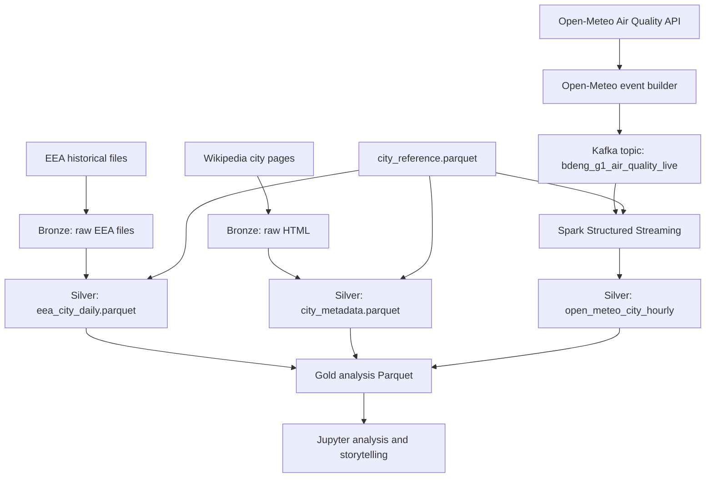

# Architecture Overview

## Core Architecture

The project builds a reproducible Big Data Engineering pipeline for air quality
patterns in selected European cities.

## Execution Modes

The adapted execution strategy is documented in
`docs/decisions/ADR-004-execution-environment-and-storage-strategy.md`.

| Mode | Purpose | Spark master | Storage | Status |
| --- | --- | --- | --- | --- |
| `local_project` | Reproducible Parquet-producing pipeline runs | `local[*]` | Project `data/` folder | Standard |
| `fh_cluster_connectivity` | FH Spark connectivity and compute evidence | `spark://172.29.16.102:7077` | No final project storage | Documented evidence |
| `fh_cluster_shared_storage` | Optional cluster end-to-end execution | FH Spark master | Confirmed shared storage | Not active unless provided |

## Storage Decision

Parquet remains the primary storage format. The reliable default storage target
is the project `data/` folder written from the local/Jupyter execution mode.

The FH Spark cluster is not used as the default Parquet persistence path because
cluster smoke tests did not confirm HDFS or another shared storage path. This is
a reliability decision, not a scope reduction.

## Phase Boundaries

- Phase 3 handles EEA historical batch ingestion only.
- Phase 4 handles Wikipedia scraping only.
- Phase 5 handles Open-Meteo client and event schema only.
- Phase 6 handles Kafka producer/topic work only.
- Phase 7 handles Spark Structured Streaming from Kafka to Parquet in the
  reliable execution mode.
- Phase 8+ build Gold datasets, visualizations, and storytelling.

No phase should silently implement another phase's work.
