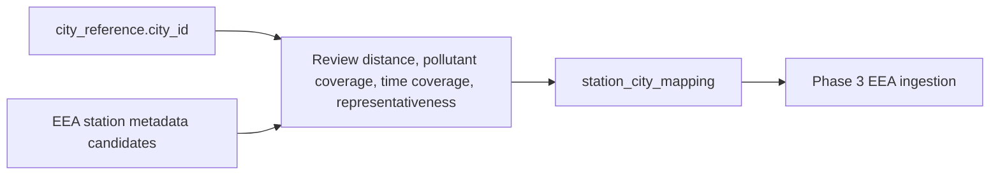

# Data Model

## Phase 2 City Reference Scope

Phase 2 defines the controlled starter city list for the city reference model.
This is city-reference work only. It does not implement EEA ingestion,
Wikipedia scraping, Open-Meteo API calls, Kafka, Spark, Gold tables, or final
analytics.

The list starts with exactly 8 European cities. Vienna and Berlin are included
because they were the Phase 1 pilot cities and all three planned source
categories were feasible for them.

| city_id_candidate | city_name | country_code | latitude | longitude | selection_rationale |
| --- | --- | --- | ---: | ---: | --- |
| vienna_at | Vienna | AT | 48.2082 | 16.3738 | Phase 1 pilot city; Open-Meteo, EEA metadata, and Wikipedia feasibility confirmed. |
| berlin_de | Berlin | DE | 52.5200 | 13.4050 | Phase 1 pilot city; Open-Meteo, EEA metadata, and Wikipedia feasibility confirmed. |
| paris_fr | Paris | FR | 48.8566 | 2.3522 | Major European capital with expected air-quality monitoring and rich city metadata. |
| madrid_es | Madrid | ES | 40.4168 | -3.7038 | Major European capital; useful southern European comparison city. |
| rome_it | Rome | IT | 41.9028 | 12.4964 | Major European capital; useful Mediterranean comparison city. |
| amsterdam_nl | Amsterdam | NL | 52.3676 | 4.9041 | Major European city with expected monitoring coverage and compact urban context. |
| warsaw_pl | Warsaw | PL | 52.2297 | 21.0122 | Major Central/Eastern European capital for regional diversity. |
| prague_cz | Prague | CZ | 50.0755 | 14.4378 | Central European capital with expected source coverage and manageable scope. |

## Canonical City Reference Schema

The city reference table is the controlled join surface for later phases. It
does not prove that downstream EEA, Wikipedia, Open-Meteo, Kafka, Spark, or
analytics outputs already exist. It only defines the stable city-level fields
that later source-specific work must map to.

### Identifier Convention

`city_id` is the stable technical identifier for joins. It uses lowercase
ASCII text in the pattern `<normalized_city_name>_<country_code_lower>`.
Spaces and punctuation are replaced or removed during normalization. The
country code suffix uses ISO 3166-1 alpha-2 in lowercase form.

Examples:

- `vienna_at`
- `berlin_de`
- `amsterdam_nl`

Once a `city_id` is used by downstream data, it should not be renamed without a
documented migration note. Downstream jobs should join on `city_id`, not on free
text city names.

### Schema

| field | type | required | nullability | rule |
| --- | --- | --- | --- | --- |
| city_id | string | yes | non-null | Unique stable key using lowercase `<normalized_city_name>_<country_code_lower>`. |
| city_name | string | yes | non-null | Human-readable display name, for example `Vienna`. |
| city_name_normalized | string | yes | non-null | Lowercase normalized city name used to derive `city_id`. |
| country_code | string | yes | non-null | ISO 3166-1 alpha-2 country code in uppercase, for example `AT`. |
| latitude | float | yes | non-null | WGS84 city coordinate used for Open-Meteo feasibility and later source alignment; must be between -90 and 90. |
| longitude | float | yes | non-null | WGS84 city coordinate used for Open-Meteo feasibility and later source alignment; must be between -180 and 180. |
| population | integer | no | nullable | Future contextual metadata, expected from Wikipedia or another documented reference source. |
| area_km2 | float | no | nullable | Future contextual metadata, expected from Wikipedia or another documented reference source. |
| population_density | float | no | nullable | Future contextual or derived metadata; may stay null if population or area is unavailable. |
| mapping_notes | string | yes | non-null | Short explanation of why the city belongs in the controlled starter scope and how source alignment should be interpreted. |
| eea_station_selection_notes | string | yes | non-null | Notes for future EEA station-to-city matching; this is not an implemented station mapping. |
| wikipedia_page_title | string | no | nullable | Planned Wikipedia page title used for metadata linkage. |
| wikipedia_url | string | no | nullable | Planned Wikipedia page URL used for traceability. |
| wikipedia_metadata_notes | string | no | nullable | Notes about expected Wikipedia metadata fields, ambiguity, or fallback handling. |
| open_meteo_coordinate_notes | string | no | nullable | Notes about coordinate assumptions for future Open-Meteo API checks. |

### Constraints And Validation Rules

- `city_id` must be unique across the city reference table.
- Required fields must not be null or empty.
- `country_code` must be exactly two uppercase letters.
- `latitude` and `longitude` must be numeric and within WGS84 ranges.
- Optional metadata fields may be null during Phase 2 and must not block city
  reference creation.
- EEA station mapping remains a documented mapping decision until later
  ingestion phases; Phase 2 must not download or process full EEA datasets.
- Wikipedia fields are linkage metadata only in Phase 2; production scraping
  and parser implementation remain out of scope.
- The schema is intentionally small enough to support focused tests in
  `tests/test_city_mapping.py`.

### Phase 2.3 Local Builder

`src/city_mapping/build_city_reference.py` implements the first deterministic
city reference builder from local constants. The module is side-effect free on
import. It writes the following local Silver artifacts only when explicitly
called:

- `data/silver/city_reference.csv`
- `data/silver/city_reference.parquet`

Both generated files are ignored by `.gitignore` under the repository data
policy. They are local Phase 2 deliverables, not committed source data.

## EEA Station Mapping Strategy

EEA measurements are station-based, while the project analysis is city-based.
Phase 2 therefore documents how future EEA station records should be associated
with the canonical `city_id`. This is a mapping strategy only; it does not
download EEA data, implement station-radius matching, run Spark, or aggregate
measurements.

For each city, candidate EEA stations must be reviewed by:

1. distance to the city reference coordinate,
2. pollutant coverage for PM2.5, PM10, and NO2,
3. time coverage overlap with the planned analysis period,
4. station class, station area, or representativeness where available,
5. country and city context consistency.

Downstream EEA processing must join through `city_id`. Free-text city names,
station names, or manually typed labels must not be used as downstream city
join keys.

### Required Station Mapping Fields

| field | type | required | purpose |
| --- | --- | --- | --- |
| city_id | string | yes | Canonical city join key from the city reference table. |
| eea_station_id | string | yes | Stable EEA station identifier from future EEA metadata. |
| eea_station_name | string | no | Human-readable station name for review only. |
| station_latitude | float | yes | Station WGS84 latitude used for distance review. |
| station_longitude | float | yes | Station WGS84 longitude used for distance review. |
| distance_km_to_city_center | float | yes | Distance from station to city reference coordinate. |
| pollutants_available | string/list | yes | Target pollutant coverage observed for PM2.5, PM10, and NO2. |
| time_coverage_start | date/string | no | Earliest observed or documented measurement date. |
| time_coverage_end | date/string | no | Latest observed or documented measurement date. |
| station_class | string | no | Station class where EEA metadata provides it. |
| station_area | string | no | Urban/suburban/rural or equivalent area context where available. |
| representativeness_notes | string | yes | Reviewer note explaining whether the station is appropriate for the city. |
| mapping_status | string | yes | One of `selected`, `candidate`, `fallback`, or `rejected`. |
| mapping_notes | string | yes | Transparent rationale for the station-to-city decision. |

### Fallback Rules

- If no nearby station covers all target pollutants, select the best documented
  candidate per pollutant and mark the mapping as constrained.
- If pollutant coverage is partial, preserve the city in the reference model
  but document unavailable pollutants before Phase 3 ingestion.
- If time coverage is too short for the planned analysis period, keep the
  station as `candidate` or `fallback` until reviewed.
- If station representativeness is unclear, do not promote the station to
  `selected` without a manual note.
- The station mapping must be reviewed before Phase 3 ingestion starts.

## Wikipedia Metadata Join Rules

Wikipedia metadata is contextual city metadata, not official ground truth. Later
phases may use it to enrich the city reference model for documentation,
comparison, and analysis context, but EEA measurements and Open-Meteo API data
must not depend on Wikipedia values being complete.

Wikipedia metadata must attach to the city reference model through `city_id`.
Page titles, page URLs, translated names, and free-text city names are traceable
source attributes only; they are not downstream join keys.

### Planned Wikipedia Metadata Fields

| city reference field | source meaning | handling rule |
| --- | --- | --- |
| wikipedia_page_title | Expected English Wikipedia page title for the city. | Store as linkage metadata; do not use as join key. |
| wikipedia_url | Expected page URL for traceability. | Store as source trace; do not fetch during Phase 2. |
| population | Contextual population value where parseable. | Nullable integer; keep null when ambiguous or missing. |
| area_km2 | Contextual area value where parseable. | Nullable float; keep null when ambiguous or missing. |
| population_density | Contextual or derived density value. | Nullable float; derive only when population and area are reliable. |
| latitude | Canonical city coordinate. | Keep from the city reference model; do not overwrite from Wikipedia without review. |
| longitude | Canonical city coordinate. | Keep from the city reference model; do not overwrite from Wikipedia without review. |
| country_code | Canonical country context. | Keep from the city reference model; Wikipedia country text is a validation clue only. |
| wikipedia_metadata_notes | Parsing, ambiguity, missing-field, or fallback notes. | Required whenever a planned metadata value is null, ambiguous, conflicting, or manually reviewed. |

### Null And Ambiguity Handling

- If `population` or `area_km2` cannot be parsed confidently, keep the field
  null and populate `wikipedia_metadata_notes`.
- If Wikipedia contains multiple population, area, or coordinate values, do not
  choose one silently; document the ambiguity and keep the target field null
  until a later parser rule is approved.
- If a page is missing, redirected, disambiguated, or not clearly about the
  city, keep metadata fields null and document the issue.
- Do not infer values from unrelated pages, search snippets, dashboards, or
  other websites.
- Do not treat Wikipedia coordinates as a replacement for the canonical
  `latitude` and `longitude` defined in the city reference table.
- Production HTML parsing and metadata Parquet output remain out of scope for
  Phase 2 unless a later issue explicitly activates them.

## Open-Meteo Mapping Rules

Open-Meteo Air Quality requests are coordinate-based. Later Open-Meteo API
client and event schema work must use the canonical city reference `latitude`
and `longitude` for each `city_id`. Phase 2 records the mapping rules only; it
does not implement an API client, event schema, Kafka producer, scheduler, or
streaming job.

### Coordinate Usage

| city reference field | Open-Meteo usage | rule |
| --- | --- | --- |
| city_id | Internal city join key | Carry into future Open-Meteo events and downstream joins. |
| latitude | API request latitude | Use the fixed WGS84 coordinate from the city reference table. |
| longitude | API request longitude | Use the fixed WGS84 coordinate from the city reference table. |
| country_code | Context and validation | Preserve in future events for traceability; do not use as API coordinate input. |
| open_meteo_coordinate_notes | Coordinate review notes | Record assumptions, corrections, or later coordinate review decisions. |

Coordinates should be treated as city-level reference coordinates, not station
locations. If a later phase changes a coordinate, the change must be documented
because it can affect API responses and comparability.

### Pollutant Field Mapping

| project pollutant | Open-Meteo hourly field | planned internal meaning |
| --- | --- | --- |
| PM2.5 | `pm2_5` | Fine particulate matter. |
| PM10 | `pm10` | Particulate matter up to 10 micrometers. |
| NO2 | `nitrogen_dioxide` | Nitrogen dioxide. |

The Phase 1 source spike confirmed these Open-Meteo field names for the pilot
cities. Later Phase 5 work should map these fields into a stable internal event
schema before Kafka is introduced in Phase 6.

### Timezone Assumption

Open-Meteo requests should use `timezone=UTC` unless a later ADR changes this
decision. Future events should carry UTC timestamps explicitly, for example
`event_time_utc` and `ingestion_time_utc`, so Spark and Parquet outputs can be
compared consistently across cities.

### Phase 5 Handoff

Phase 5 may implement the Open-Meteo client and event schema using these rules.
Phase 2 must stop at documentation and city reference support. No API calls,
production client behavior, event schema implementation, Kafka producer, or
Spark streaming logic belongs in this issue.

## Phase 2 Scope Boundary

Allowed in Phase 2:

- define stable city identifiers,
- document the city reference scope,
- design the city reference schema,
- prepare EEA station mapping rules,
- prepare Wikipedia metadata join rules,
- prepare Open-Meteo coordinate and field mapping rules,
- add city reference validation tests.

Not allowed in Phase 2:

- EEA data download or ingestion,
- production Wikipedia scraping,
- Open-Meteo production client behavior,
- Kafka producer implementation,
- Spark Structured Streaming,
- Bronze/Silver/Gold transformations beyond the local city reference outputs
  planned for later Phase 2 issues,
- final analytics or visualizations.

## Later Data Model Work

TODO:

- Define Bronze schemas per source.
- Define Silver canonical model for city and air quality joins.
- Define Gold analytical tables for the project research question.
