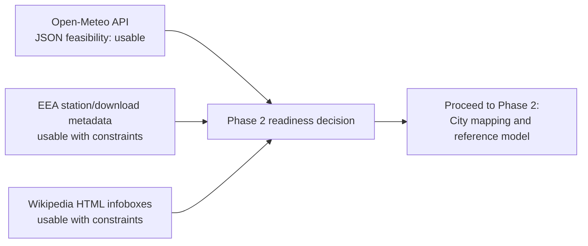

# Data Sources

## Phase 1 Pilot Scope

Phase 1 is a source spike and feasibility check. It uses a deliberately small
pilot scope so each data source can be inspected manually before the project
commits to the Phase 2 city reference model.

This section is **not** the final city reference model. It does not create
`city_reference.parquet`, does not define EEA station matching, and does not
implement ingestion logic.

### Pilot Cities

| city_name | country_code | latitude | longitude | reason |
| --- | --- | ---: | ---: | --- |
| Vienna | AT | 48.2082 | 16.3738 | Likely coverage across Open-Meteo, Wikipedia, and EEA; central European capital with expected monitoring availability. |
| Berlin | DE | 52.5200 | 13.4050 | Likely coverage across Open-Meteo, Wikipedia, and EEA; large European capital with expected monitoring availability. |

### Target Pollutants

Phase 1 checks the planned core pollutants where each source supports them:

| pollutant | Open-Meteo check | EEA check | Wikipedia check | Notes |
| --- | --- | --- | --- | --- |
| PM2.5 | Check API field availability. | Check historical availability for pilot cities or nearby stations. | Not expected as direct city metadata. | Use for air quality comparison if available. |
| PM10 | Check API field availability. | Check historical availability for pilot cities or nearby stations. | Not expected as direct city metadata. | Use for air quality comparison if available. |
| NO2 | Check API field availability. | Check historical availability for pilot cities or nearby stations. | Not expected as direct city metadata. | Open-Meteo may expose this as `nitrogen_dioxide`; field name must be verified. |

If a pollutant is unavailable or named differently in a source, Phase 1 must
record that as a source-specific constraint. It must not silently replace the
approved pollutant scope or expand to additional pollutants.

### Source Spike Usage

The same two pilot cities must be used consistently across the Phase 1 checks:

| Source | Phase 1 use | Expected evidence |
| --- | --- | --- |
| Open-Meteo Air Quality API | Verify API reachability, field names, timestamps, units, and missing-value behavior for Vienna and Berlin. | Notebook notes and/or tiny JSON evidence if allowed by data hygiene rules. |
| EEA historical air quality data | Verify historical availability for Vienna and Berlin or clearly document station/city constraints. | Documentation of access path, fields, pollutant availability, and mapping risk. |
| Wikipedia city pages | Verify raw HTML availability and metadata candidates for Vienna and Berlin. | Notebook notes and/or tiny HTML evidence if allowed by data hygiene rules. |

### Phase 1 Boundaries

Allowed:

- Document source feasibility.
- Inspect two pilot cities.
- Check PM2.5, PM10, and NO2 availability.
- Record source-specific constraints.

Not allowed in this issue:

- Final city reference model.
- `city_reference.parquet`.
- Station-radius matching.
- Production schemas.
- Kafka producer logic.
- Spark processing logic.
- Full ingestion jobs.

## Phase 1 Source Feasibility Matrix

This matrix consolidates the three Phase 1 source spikes. It is evidence for
source feasibility only. It does not mean ingestion, parsing, Kafka publishing,
Spark processing, or analytical outputs are implemented.

| Source | Status | Format | Key Fields | Risks | Decision |
| --- | --- | --- | --- | --- | --- |
| Open-Meteo Air Quality API | usable | JSON | `hourly.time`, `pm2_5`, `pm10`, `nitrogen_dioxide`, `hourly_units`, `latitude`, `longitude`, `timezone`, `utc_offset_seconds` | API field names differ from display labels; missing values must still be handled; short-window sample is not evidence of long-term completeness. | Use as REST API source and later Kafka input path after schema and missing-value handling are defined in Phase 5. |
| EEA historical air quality data | usable with constraints | Station metadata plus pollutant-specific Parquet/download exports | `AirQualityStation`, `AirQualityStationEoICode`, `AQStationName`, station coordinates, pollutant, unit, year coverage; future time series must expose timestamp/period and value fields. | EEA is station-based, not city-based; station selection and pollutant/time coverage differ by city; timestamp field semantics still need row-level verification before Phase 3. | Proceed to Phase 2 city/station mapping before any EEA aggregation or ingestion implementation. |
| Wikipedia city pages | usable with constraints | HTML infobox/page markup | country context, population candidates, area candidates, coordinate candidates, administrative identifiers | Infobox labels are not stable; values can include footnotes, dates, nested labels, and varying administrative scopes; context fields are not official statistical ground truth. | Use as web scraping source in Phase 4 with raw HTML preservation, conservative parser tests, null handling, and metadata notes. |

### Phase 1 Source Flow



### Phase 2 Readiness Decision

**Go for Phase 2 with constraints.**

All three required source categories are technically feasible for the approved
project scope:

- Open-Meteo can provide PM2.5, PM10, and NO2-equivalent API fields for the
  pilot cities.
- EEA has station-level historical air quality metadata and target pollutant
  coverage near both pilot cities, but requires explicit station-to-city
  mapping.
- Wikipedia exposes city metadata candidates through parseable infobox HTML,
  but requires conservative parser design and fallback handling.

Phase 2 may start only as city mapping and reference-model work. It must not
skip directly into full ingestion, Kafka, Spark, or Gold-layer implementation.

### Required Fields For Future Phases

| Future phase | Required fields or decisions |
| --- | --- |
| Phase 2 city reference | stable `city_id`, city name, country code, latitude, longitude, source-specific notes, station mapping notes. |
| Phase 3 EEA batch work | station identifier, pollutant, timestamp or period, value, unit, quality or validity fields, station-to-city rule. |
| Phase 4 Wikipedia scraping | raw HTML path, country, population, area, coordinates, parser notes, missing-field behavior. |
| Phase 5 Open-Meteo client/schema | event time, ingestion time, city identifier, coordinates, `pm2_5`, `pm10`, `nitrogen_dioxide`, units, schema version. |

## Phase 1 Sample Data Hygiene Policy

Phase 1 may create tiny local source-spike samples only when they are needed to
prove feasibility. These samples are evidence for manual review, not project
datasets and not pipeline outputs.

### Allowed Local Samples

| Sample type | Allowed location | Naming pattern | Size expectation | Git policy |
| --- | --- | --- | --- | --- |
| Open-Meteo JSON evidence | `data/bronze/open_meteo_raw/` | `sample_open_meteo_<city>_<country>.json` | Tiny response sample, preferably one short request window. | Ignored by `data/**/*.json`. |
| Wikipedia HTML evidence | `data/bronze/wikipedia_html/` | `sample_wikipedia_<city>_<country>.html` | Tiny HTML excerpt such as an infobox, not a full page archive unless explicitly justified. | Ignored by `data/**/*.html`. |
| EEA metadata notes | `docs/data_sources.md` | Markdown tables and notes. | Prefer documentation over raw EEA files in Phase 1. | Tracked as documentation. |

### Not Allowed In Git

- Secrets, API keys, tokens, credentials, cookies, or personal identifiers.
- `.env` files.
- Large raw data files.
- Full uncontrolled raw datasets.
- Generated Parquet, CSV, JSON, HTML, ZIP, or checkpoint outputs.
- Local absolute machine paths.
- Notebook outputs containing large embedded source data.

### Required Hygiene Rules

- Keep source samples small and source-specific.
- Keep `.gitkeep` files trackable so empty folder structure remains visible.
- Treat all `data/` files except `.gitkeep` as local/generated unless a later
  documented policy explicitly allows committing a tiny fixture.
- Document the evidence path and decision in Markdown instead of relying on
  raw files as the only proof.
- Never put secrets or credentials in notebooks, Markdown, `.env.example`, or
  sample files.

The repository `.gitignore` must protect:

```gitignore
data/**/*.parquet
data/**/*.csv
data/**/*.json
data/**/*.html
data/**/checkpoints/**
!**/.gitkeep
```

## Open-Meteo Phase 1 Feasibility

Status: **usable**

Open-Meteo Air Quality API access was tested for the two Phase 1 pilot cities
with a deliberately small one-day hourly request. This was a source feasibility
check only. It did not create a reusable API client, Kafka event schema,
producer, scheduler, or streaming path.

### Request Scope

| city_name | country_code | latitude | longitude | request scope | evidence |
| --- | --- | ---: | ---: | --- | --- |
| Vienna | AT | 48.2082 | 16.3738 | `forecast_days=1`, hourly `pm10,pm2_5,nitrogen_dioxide`, `timezone=UTC` | `data/bronze/open_meteo_raw/sample_open_meteo_vienna_at.json` |
| Berlin | DE | 52.5200 | 13.4050 | `forecast_days=1`, hourly `pm10,pm2_5,nitrogen_dioxide`, `timezone=UTC` | `data/bronze/open_meteo_raw/sample_open_meteo_berlin_de.json` |

The evidence JSON files are intentionally small local source-spike samples.
They are stored under `data/bronze/open_meteo_raw/` and protected by the
repository data ignore rules.

### Observed Response Structure

| Area | Observed result |
| --- | --- |
| Top-level fields | `latitude`, `longitude`, `elevation`, `timezone`, `timezone_abbreviation`, `utc_offset_seconds`, `hourly_units`, `hourly` |
| Hourly fields | `time`, `pm10`, `pm2_5`, `nitrogen_dioxide` |
| Timestamp format | `hourly.time` values are ISO-8601-like hourly strings. Requests used `timezone=UTC`; response `utc_offset_seconds` was `0`. |
| Units | `hourly_units` reports pollutant units as micrograms per cubic meter (`ug/m3` equivalent). |
| Sample size | 24 hourly records per pilot city. |
| Missing values in sample | No missing values were observed for `pm10`, `pm2_5`, or `nitrogen_dioxide` in the two saved samples. |

### Pollutant Mapping

| Approved pollutant | Open-Meteo field observed | Phase 1 decision |
| --- | --- | --- |
| PM2.5 | `pm2_5` | Usable; field name differs from display label. |
| PM10 | `pm10` | Usable. |
| NO2 | `nitrogen_dioxide` | Usable with field-name mapping; do not expect an `no2` field. |

### Risks And Constraints

- Open-Meteo uses API field names rather than presentation labels. Future code
  must map NO2 to `nitrogen_dioxide` and PM2.5 to `pm2_5`.
- The Phase 1 sample proves short-window reachability only. It is not evidence
  for long-term availability or historical completeness.
- Future ingestion must handle missing values even though the two source-spike
  samples did not contain missing pollutant values.
- Open-Meteo current or forecast data must not be treated as directly
  equivalent to historical EEA measurements without clear context fields.

### Phase 1 Decision

Open-Meteo is **usable** for the planned REST API source and later Kafka path,
subject to explicit field mapping and missing-value handling in later phases.

## EEA Phase 1 Feasibility

Status: **usable with constraints**

EEA historical air quality data availability was checked through the EEA
station metadata and download service for the two Phase 1 pilot cities. This
was a metadata-level feasibility check only. It did not download full EEA time
series data, create an EEA ingestion job, run Spark, define station-radius
matching, or write Bronze/Silver/Gold outputs.

### Access Path

| Access path | Purpose | Phase 1 observation |
| --- | --- | --- |
| EEA station spatial service | Find monitoring stations and pollutant-specific availability near pilot cities. | ArcGIS REST layer `AirQualityDownloadServiceEUMonitoringStations/MapServer/0` is queryable and returns station metadata, coordinates, pollutant labels, year ranges, and Parquet download links in station popup metadata. |
| EEA Air Quality Download Service | Download selected air quality measurement time series. | EEA metadata describes country/city/pollutant filtering and zipped Parquet outputs for selected time series. |
| Station-level Parquet links | Download pollutant-specific validated E1a time series for individual stations. | Station metadata includes pollutant-specific Parquet links, but Phase 1 did not download those files. |

Relevant public service references:

- Station metadata REST service: `https://air.discomap.eea.europa.eu/arcgis/rest/services/AirQuality/AirQualityDownloadServiceEUMonitoringStations/MapServer`
- Station data viewer: `https://discomap.eea.europa.eu/App/AQViewer/index.html?fqn=Airquality_Dissem.b2g.AirQualityStatistics`
- Download web app referenced by station metadata: `https://eeadmz1-downloads-webapp.azurewebsites.net`

### Metadata Query Scope

The metadata query used the Phase 1 pilot city coordinates and a small bounding
box around each city. Returned station metadata was inspected for target
pollutants PM2.5, PM10, and NO2.

| city | metadata result | target pollutant evidence | key risk | decision |
| --- | --- | --- | --- | --- |
| Vienna | 37 nearby station records with at least one target pollutant in the inspected bounding box. | `Taborstraße` (`AT90TAB`) reports NO2, PM2.5, and PM10 for 2013-2024; `AKH` (`AT90AKC`) reports PM2.5, PM10, and NO2; `Stephansplatz` (`AT9STEF`) reports NO2. | Need a documented rule for selecting stations and avoiding arbitrary city-center bias. | usable with constraints |
| Berlin | 68 nearby station records with at least one target pollutant in the inspected bounding box. | `Berlin Mitte` (`DEBE068`) reports NO2 and PM10 for 2013-2024 and PM2.5 for 2020-2024; several nearby Berlin stations report NO2. | PM2.5 availability may have shorter history at some stations; station class and representativeness need review. | usable with constraints |

### Observed Or Expected Fields

| Field category | Observed or expected fields | Notes |
| --- | --- | --- |
| Station identity | `AirQualityStation`, `AirQualityStationEoICode`, `AQStationName`, `Country`, `CountryCode` | Observed in EEA station metadata. |
| Geometry | longitude, latitude | Returned by the ArcGIS REST query with `outSR=4326`. |
| Pollutant | PM2.5, PM10, NO2 labels in popup metadata and pollutant-specific Parquet links | Observed in station popup metadata. |
| Unit | `ug/m3` equivalent in popup metadata | Observed for PM2.5, PM10, and NO2 links. |
| Time coverage | pollutant-specific year ranges such as 2013-2024 or 2020-2024 | Observed in station popup metadata. |
| Measurement timestamp | expected measurement timestamp or period field in downloaded time series | Must be verified during the EEA ingestion phase before transformation logic is written. |
| Measurement value | expected numeric concentration value | Must be verified from a tiny controlled sample in the EEA ingestion phase. |
| Validity or quality flags | expected in EEA time series or metadata | Must be checked before using values analytically. |

### Timestamp Handling

The station metadata exposes pollutant-specific year coverage. The EEA
download documentation describes date filtering over measurement time ranges.
Phase 1 did not inspect full time series rows, so the exact timestamp column
name and timezone semantics must be verified before Phase 3 ingestion logic.

Future EEA processing must preserve:

- original measurement timestamp or period,
- source station identifier,
- pollutant,
- unit,
- measured value,
- quality or validity indicators where available,
- processing timestamp.

### Station-To-City Mapping Risk

EEA data is station-based, not city-based. Vienna and Berlin both have multiple
nearby stations with different pollutants, year ranges, station classes, and
representativeness. Phase 2 must define a transparent station selection rule
before any city-level EEA aggregation is created.

The project must not silently choose the nearest station without documenting:

- station distance to the city reference coordinate,
- pollutant availability,
- time coverage,
- station class or representativeness if available,
- fallback behavior when PM2.5, PM10, or NO2 is missing.

### Phase 1 Decision

EEA is **usable with constraints** for the planned file/batch historical source.
The main constraint is not basic availability; it is the station-to-city mapping
and pollutant/time-coverage selection rule required in Phase 2.

## Wikipedia Phase 1 Feasibility

Status: **usable with constraints**

Wikipedia city metadata feasibility was checked for the two Phase 1 pilot
cities. Raw page HTML was fetched, and a small infobox HTML excerpt was saved
for each city as local evidence. This was a source feasibility check only. It
did not implement a production scraper, parser module, crawler, city metadata
Parquet output, or automated extraction workflow.

### Request Scope

| city_name | country_code | source page | evidence sample | result |
| --- | --- | --- | --- | --- |
| Vienna | AT | `https://en.wikipedia.org/wiki/Vienna` | `data/bronze/wikipedia_html/sample_wikipedia_vienna_at.html` | HTML reachable; infobox found. |
| Berlin | DE | `https://en.wikipedia.org/wiki/Berlin` | `data/bronze/wikipedia_html/sample_wikipedia_berlin_de.html` | HTML reachable; infobox found. |

The saved evidence files are intentionally small HTML samples containing the
raw infobox excerpt plus source metadata. They are not full Wikipedia page
archives and are protected by `data/**/*.html` in `.gitignore`.

### Metadata Candidates

| Candidate field | Vienna observation | Berlin observation | Phase 1 decision |
| --- | --- | --- | --- |
| Country | Infobox contains country context. | Infobox contains country context. | Parseable candidate. |
| Area | Infobox contains area-related rows. | Infobox contains area-related rows. | Parseable candidate, but labels may vary. |
| Population | Infobox contains population-related rows. | Infobox contains population-related rows. | Parseable candidate, but date and scope labels need review. |
| Coordinates | Page or infobox contains coordinate markup. | Page or infobox contains coordinate markup. | Parseable candidate; validate exact extraction in Phase 4. |
| ISO/geocode context | Infobox contains ISO/geocode-like administrative identifiers. | Infobox contains ISO/geocode-like administrative identifiers. | Optional context only, not part of Phase 1 output. |

### Observed Structure

| Area | Observed result |
| --- | --- |
| HTML access | Both pilot pages returned HTML successfully. |
| Primary table | `table.infobox` exists for both pilot pages. |
| Parser used for spike | BeautifulSoup with Python's built-in `html.parser` in the active local environment. |
| Preferred future parser | BeautifulSoup with `lxml` after the project environment is installed from `requirements.txt`. |
| Sample size | Infobox excerpt only; full page HTML was not committed. |

### Risks And Constraints

- Wikipedia page structure is not a stable API contract. Infobox labels can
  change across pages and over time.
- Population and area rows may use nested labels, footnotes, dates, or different
  administrative scopes.
- Coordinates may appear outside the infobox or in multiple formats.
- Values from Wikipedia should be treated as contextual metadata, not official
  statistical ground truth.
- Phase 4 must implement parser tests with fixed HTML fixtures before relying
  on extracted values.

### Fallback Strategy

If a field is missing or inconsistent in Phase 4:

- keep the raw HTML evidence,
- set the parsed field to null,
- add a `mapping_notes` or `metadata_notes` explanation,
- prefer explicit manual review over silent guessing,
- do not block the core air-quality pipeline on optional context fields such as
  population density.

### Phase 1 Decision

Wikipedia is **usable with constraints** for city metadata enrichment. The
source is suitable for contextual fields such as population, area, coordinates,
and country context, but the final parser must be conservative, tested, and
transparent about missing or ambiguous values.

## Phase 3 EEA Source Access

### Overview

Phase 3 implements controlled EEA historical air quality batch ingestion for the
8 starter cities and the 3 core pollutants (PM2.5, PM10, NO2) defined in Phase 2.
Before any ingestion logic is written, this section documents how EEA raw data
is obtained, stored, and kept out of the repository.

This section is **documentation and policy only**. It does not download EEA
data, implement the EEA loader, run Spark, or produce Silver or Gold outputs.

### EEA Source Access Path

EEA historical air quality time series are available through the EEA Air Quality
Download Service. The following access paths are accepted for Phase 3:

| Access path | Description | Phase 3 use |
| --- | --- | --- |
| EEA Air Quality Download web app | Interactive download at `https://eeadmz1-downloads-webapp.azurewebsites.net` | Select country, station, pollutant, and year range; download zipped Parquet or CSV. |
| EEA station spatial service | ArcGIS REST layer for station metadata at `https://air.discomap.eea.europa.eu/arcgis/rest/services/AirQuality/AirQualityDownloadServiceEUMonitoringStations/MapServer/0` | Used in Phase 1 to identify candidate stations; Phase 3 may re-query for specific station IDs. |
| Station-specific Parquet links | Pollutant-specific validated E1a download links embedded in EEA station metadata popups | Preferred Phase 3 access path for individual station time series. |

EEA raw files downloaded for Phase 3 must be stored locally under
`data/bronze/eea/` and must not be committed to the repository.

### Raw-Data Policy

| Rule | Detail |
| --- | --- |
| Large raw EEA files must **not** be committed | All `data/**/*.parquet`, `data/**/*.csv`, `data/**/*.json` are git-ignored by repository policy. |
| Raw files are kept local under `data/bronze/eea/` | This directory is git-ignored. Folder structure is maintained with `.gitkeep`. |
| Raw files must be **reproducibly referenced** | Document the exact EEA download URL, station ID, pollutant, and year range used in `docs/data_sources.md` or in the notebook so a reviewer can re-download the same source files. |
| Tiny controlled test fixtures are allowed | Small in-memory or temporary files used only in pytest fixtures are acceptable; they must not contain real sensitive measurement data and must not be committed. |
| Phase 3 must not download data at bulk scale | Only the stations and time periods needed for the 8 starter cities and core pollutants are relevant. |

### Naming Convention For Local EEA Files

Files placed under `data/bronze/eea/` should follow this naming pattern:

```
eea_<station_id>_<pollutant_key>_<year_start>_<year_end>.<ext>
```

Examples:

```
eea_AT90TAB_pm25_2018_2023.parquet
eea_AT90TAB_no2_2018_2023.parquet
eea_DEBE068_pm10_2020_2024.csv
```

Where:

- `<station_id>` is the EEA station EoI code, e.g. `AT90TAB`.
- `<pollutant_key>` is one of `pm25`, `pm10`, `no2`.
- `<year_start>` and `<year_end>` are the inclusive year range of the download.
- `<ext>` is `parquet` or `csv` depending on the download format used.

Tiny sample files used only for local validation may use a `sample_` prefix:

```
sample_eea_AT90TAB_pm25_2022.csv
```

### Git-Ignore Verification

The repository `.gitignore` covers all EEA raw data files through the following
rules:

```gitignore
data/**/*.parquet
data/**/*.csv
data/**/*.json
data/**/*.html
data/**/checkpoints/**
!**/.gitkeep
```

To confirm that a local EEA file is correctly ignored before attempting to add
it:

```bash
git check-ignore -v data/bronze/eea/sample_test.csv
```

The expected output is a line referencing the `.gitignore` rule and the file
path. If the file does not appear as ignored, check the `.gitignore` rules
before proceeding.

### Reproducibility Contract

Because large EEA raw files are not committed, reproducibility depends on
documentation. The following information must be recorded in this document or in
notebook 02 for every EEA download used in Phase 3:

| Item | Example |
| --- | --- |
| Station EoI code | `AT90TAB` |
| Station name | `Taborstraße` |
| City reference city_id | `vienna_at` |
| Pollutant | PM2.5 |
| Year range | 2018–2023 |
| Download URL or service endpoint | `https://eeadmz1-downloads-webapp.azurewebsites.net` |
| File format | Parquet (E1a validated) |
| Download date | 2026-05-30 |
| Local path | `data/bronze/eea/eea_AT90TAB_pm25_2018_2023.parquet` |

This table will be populated during Phase 3 implementation issues (3.3, 3.4).

### Phase 3 Scope Boundary

**Included in this issue (3.1):**

- Document the accepted EEA source access path.
- Define raw-data policy and naming conventions.
- Confirm git-ignore behaviour.
- Record scope boundary.

**Not included in this issue:**

- Bulk EEA download or any data download.
- EEA loader implementation.
- Station-to-city mapping implementation.
- Spark batch processing job.
- Silver or Gold Parquet output.
- Any Open-Meteo, Wikipedia, Kafka, or streaming work.

## Phase 3 EEA Data Quality Rules

Phase 3 validates normalized EEA measurement rows before daily aggregation.
These rules protect `data/silver/eea_city_daily.parquet` from silently using
bad station records.

### Required Fields

The normalized row-level EEA DataFrame must contain these required fields:

| field | required behavior |
| --- | --- |
| `city_id` | Non-null canonical city join key from station mapping. |
| `datetime_begin` | Non-null, parseable timestamp normalized to UTC. |
| `pollutant` | Non-null and one of PM2.5, PM10, NO2. |
| `concentration` | Non-null numeric measured value, non-negative after validation. |
| `unit` | Non-null, non-empty unit string; expected `µg/m³` or equivalent source spelling. |

Missing required columns fail validation with `ValueError`. Null or empty
required fields fail validation with `ValueError`.

### Rejected Or Filtered Rows

| condition | behavior |
| --- | --- |
| Negative concentration | Row is rejected before aggregation. |
| Missing or non-numeric concentration | Row is rejected before aggregation. |
| Unsupported pollutant outside PM2.5, PM10, NO2 | Row is rejected before aggregation. |
| Invalid or unparseable timestamp | Validation fails; source file requires review. |
| Missing unit | Validation fails; source file requires review. |
| Missing `city_id` | Validation fails; station mapping must be fixed. |
| Known invalid validity flag such as `-1`, `-99`, or `-999` | Row is rejected during raw loading. |

### Limitations

- These checks do not prove that a station is representative for a whole city;
  that remains a station mapping decision.
- These checks do not compare EEA historical values with Open-Meteo live/API
  values.
- These checks do not implement Gold analytics or causal interpretation.
- If real EEA files expose different column names, the loader may map them to
  the canonical concepts, but the validation rules remain unchanged.
