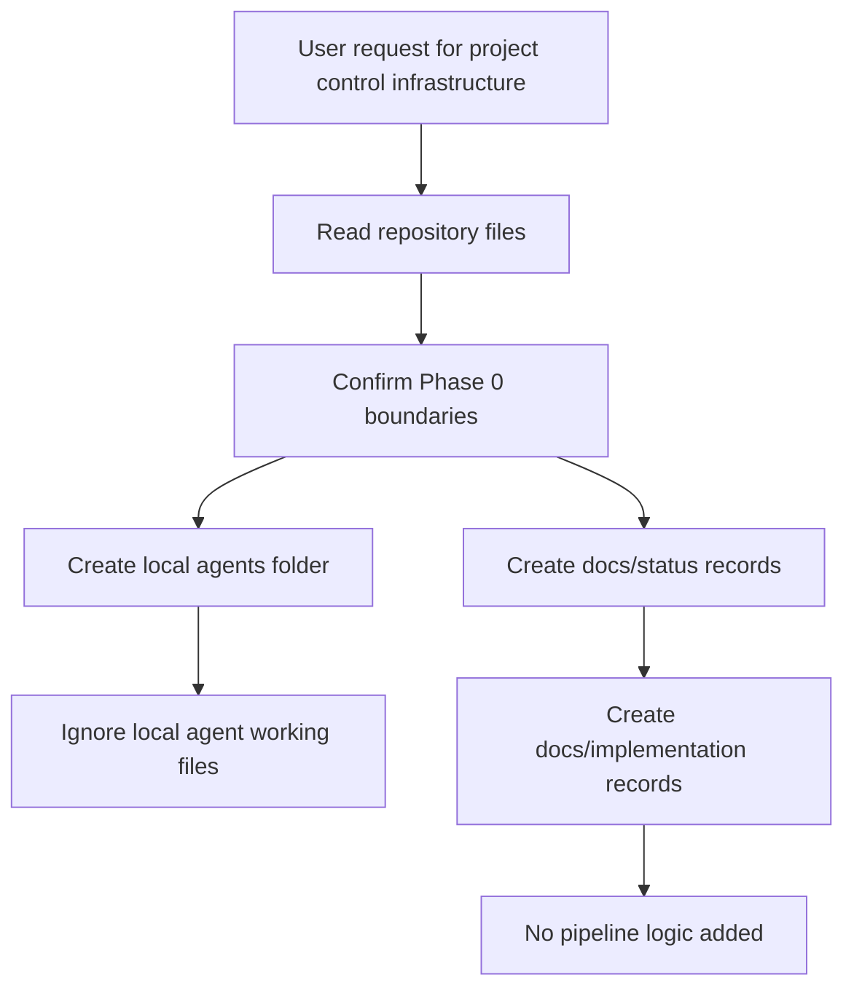
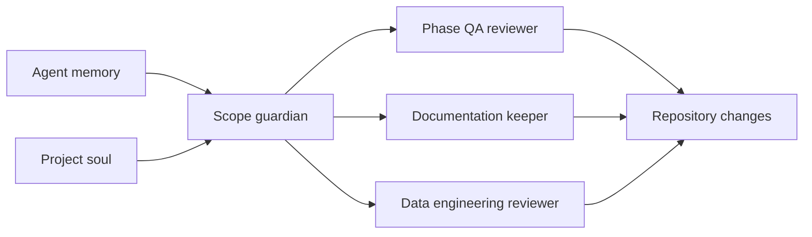

# Phase 0 Infrastructure Documentation

## Objective

Create repository-level infrastructure that helps future contributors and AI
agents understand the project state, stay inside scope, and document changes
without implementing Phase 1+ pipeline logic.

## Implemented In This Step

- Local AI agent instructions under `agents/`.
- Local AI project memory under `agents/memory.md`.
- Local AI project soul under `agents/soul.md`.
- Git ignore rule for `agents/`.
- Status documentation under `docs/status/`.
- Implementation documentation index under `docs/implementation/README.md`.
- This Phase 0 infrastructure implementation note.

## Scope Boundary

This step does not implement:

- Data ingestion.
- API requests.
- Wikipedia scraping.
- Kafka producer logic.
- Spark streaming or batch transformations.
- Parquet table creation.
- Analysis or visualization outputs.

## Documentation Flow

## Agent Governance Model

## Current Project State After This Step

The project remains in Phase 0. The latest formal QA decision is:

**Approved for Phase 1 after notebook JSON fixes**

## Validation

- Repository files were inspected before creating this infrastructure.
- No source module or test file was modified.
- No data files were added.
- No external API, scraper, Kafka, Spark, or Docker service was started.

## Known Limitations

- Agent files are local and ignored by git. This is intentional to avoid
  committing mutable AI memory.
- Stable status and implementation records are tracked under `docs/`.
- The notebook JSON issue remains unresolved by design because this step only
  creates project-control infrastructure.
