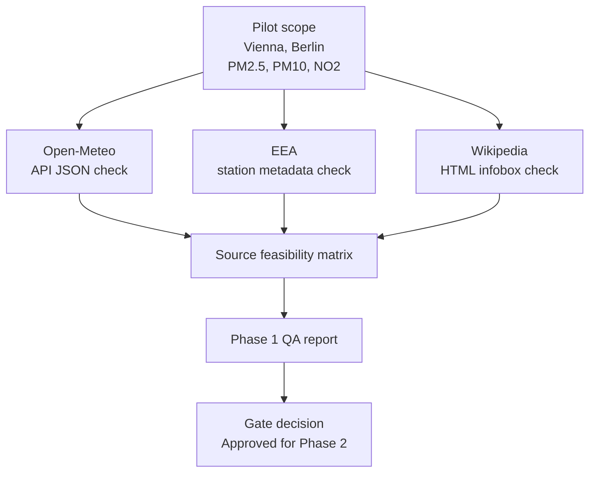

# Phase 1 Source Feasibility Implementation

## Objective

Validate whether the three approved source categories are technically feasible
for the project before any full pipeline implementation starts.

Phase 1 answers this question:

Can Open-Meteo, EEA, and Wikipedia support the planned city-level air quality
pipeline for the pilot cities Vienna and Berlin?

## Implemented In Phase 1

- Defined Vienna and Berlin as pilot cities.
- Defined PM2.5, PM10, and NO2 as target pollutants for source checks.
- Checked Open-Meteo API reachability and field availability.
- Checked EEA station metadata availability and target pollutant coverage.
- Checked Wikipedia HTML/infobox availability and parseable metadata
  candidates.
- Defined Phase 1 sample data hygiene rules.
- Created a consolidated source feasibility matrix.
- Created a Phase 1 QA report and Phase 2 gate decision.

## Scope Boundary

Phase 1 did not implement:

- final city reference model,
- EEA ingestion,
- production Wikipedia scraper,
- reusable Open-Meteo client,
- Kafka producer,
- Spark Structured Streaming,
- Bronze/Silver/Gold transformations,
- analysis outputs,
- dashboard, Airflow, dbt, PostgreSQL, cloud, or ML.

## Source Feasibility Summary

| Source | Status | Main evidence | Main constraint |
| --- | --- | --- | --- |
| Open-Meteo | usable | JSON responses for Vienna and Berlin contain `pm10`, `pm2_5`, `nitrogen_dioxide`, and hourly timestamps. | Later schema must map source field names and handle missing values. |
| EEA | usable with constraints | Station metadata near Vienna and Berlin shows target pollutant availability. | Phase 2 must define station-to-city mapping rules. |
| Wikipedia | usable with constraints | Infobox HTML exists for Vienna and Berlin with country, population, area, and coordinate candidates. | Parser must be conservative and tested because labels are unstable. |

## Source Flow

## Files Updated

| File | Purpose |
| --- | --- |
| `docs/data_sources.md` | Main Phase 1 source feasibility documentation and matrix. |
| `notebooks/00_project_scope_and_sources.ipynb` | Notebook-level Markdown summary of Phase 1 source checks. |
| `docs/qa/phase1_qa_report.md` | QA review and Phase 2 gate decision. |
| `docs/status/current_status.md` | Latest project state. |
| `docs/status/phase_gate_register.md` | Phase gate status. |
| `docs/status/project_log.md` | Chronological implementation log. |
| `.gitignore` | Ensures local JSON/HTML samples remain ignored. |

## Local Evidence Files

The following local evidence files may exist after Phase 1 source spikes:

- `data/bronze/open_meteo_raw/sample_open_meteo_vienna_at.json`
- `data/bronze/open_meteo_raw/sample_open_meteo_berlin_de.json`
- `data/bronze/wikipedia_html/sample_wikipedia_vienna_at.html`
- `data/bronze/wikipedia_html/sample_wikipedia_berlin_de.html`

They are ignored by git and are not production data assets.

## Validation Performed

- Notebook JSON validation passed for all notebooks.
- Notebook outputs remained at 0.
- Open-Meteo sample JSON files were structurally valid when present locally.
- Wikipedia HTML samples were HTML-like and contained infobox evidence when
  present locally.
- `git status --short --ignored` showed sample files as ignored.
- Scope search found no implemented Kafka producer, Spark job, full ingestion,
  production scraper, reusable API client, or Gold-layer logic.

`python -m pytest` could not run in the active interpreter because `pytest` is
not installed. This remains a local environment issue.

## Phase 2 Handoff

Phase 2 may start with City Mapping and Reference Model work.

The first Phase 2 tasks should define:

- stable `city_id` values,
- city names and country codes,
- fixed reference coordinates,
- EEA station-to-city mapping rules,
- Open-Meteo coordinate mapping,
- Wikipedia metadata join behavior,
- validation tests for required city reference fields.

Do not skip into Phase 3+ ingestion or Phase 6+ Kafka/Spark work.
